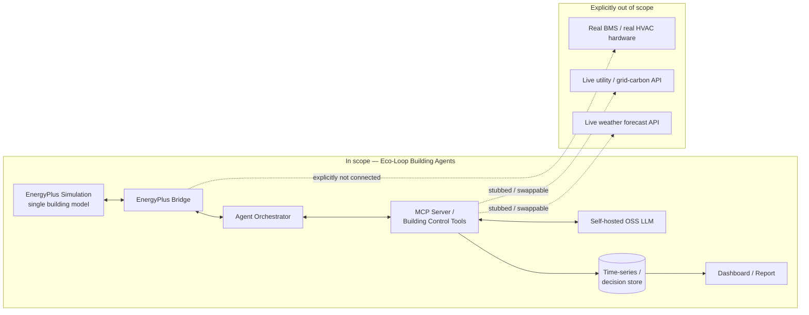

# 00 — Project Overview

**Project:** Eco-Loop Building Agents
**Document status:** Foundational — every other document in this Project Bible inherits its scope, assumptions, and success criteria from this one.

---

## 1. What this document resolves before anything else

The source brief asks for two things that are in tension. It wants documentation that "resembles" what Honeywell, Siemens, NVIDIA, Microsoft, or Google would produce for a production control system — full ADRs, threat models, fault-injection test plans, risk registers. It also describes a project with a 3-minute demo video and a percentage-weighted grading rubric, which are the unmistakable signatures of a time-boxed proof-of-concept (PoC), not a certified building-automation product.

Those two framings are not reconcilable by picking one and ignoring the other, so this specification resolves the tension explicitly rather than silently:

- **Every interface, protocol, and module boundary in this Project Bible is chosen as if it will be extended into production.** MCP as the tool-calling boundary, a deterministic validator between the LLM and any actuator, structured logging, and idempotent control actions all cost little extra effort now and are expensive to retrofit later. Where a decision has a "cheap now, expensive later" asymmetry, this spec pays the cost now.
- **Every acceptance criterion, test depth, and operational guarantee in this Project Bible is scoped to what a small team can actually deliver and honestly verify inside a PoC timeline** (nominally 2–6 weeks based on the deliverable list). Where "production" would require materially more — 24/7 on-call, formal safety certification, multi-tenant isolation, live-hardware fail-safes — this is called out explicitly as **out of scope**, not quietly assumed away.

This distinction — *production-shaped interfaces, PoC-scoped guarantees* — is the single most important design decision in this Project Bible and is referenced by nearly every later document.

## 2. Objectives

**Primary objective.** Build a running system that closes the loop EnergyPlus → sensor data → LLM agent (via MCP tools) → control actions → EnergyPlus, and that measurably reduces simulated energy consumption relative to a baseline schedule-driven run while keeping thermal comfort inside a stated ASHRAE 55 band, for at least one representative building model.

**Secondary objectives**, in priority order:

1. Demonstrate genuine agentic tool use (not a single scripted prompt-response pair) — the LLM must observe, reason, call tools, and adapt across at least one full simulated day without a human in the loop.
2. Produce an architecture that a second engineer could pick up and extend to a second building or a second LLM backend without rewriting the core loop.
3. Produce evidence — not assertion — for the energy/comfort trade-off, in a form (dashboard + report) a non-specialist reviewer can evaluate in minutes.
4. Keep the system's safety property auditable: every control action the AI takes must be traceable to a validated, bounded, logged decision — never a raw, unchecked LLM output landing on an actuator.

## 3. Scope

### 3.1 In scope

- A single EnergyPlus building model (one or a small number of thermal zones — see §6, System Boundaries), simulated with a standard EPW weather file.
- A closed control loop implemented against **EnergyPlus's native Python Runtime API** (justified in `07_EnergyPlus_Design.md`), running on one host.
- One self-hosted, open-source LLM, accessed through an OpenAI-compatible or native tool-calling interface (Ollama, vLLM, or llama.cpp-server class inference stack).
- An MCP server exposing a small, fixed set of building-control tools (defined exhaustively in `09_MCP_Architecture.md`).
- A deterministic safety/validation layer that sits between every LLM-proposed action and the simulation, independent of the LLM.
- Local, embedded persistence for telemetry and decision logs, with a documented production migration path.
- A comparison dashboard/report: baseline (schedule-driven) run vs. agent-driven run, on energy (kWh) and comfort (PMV/PPD against ASHRAE 55).
- The documentation, demo video, and presentation deliverables listed in the brief.

### 3.2 Out of scope

Explicitly, and for stated reasons — not by omission:

| Excluded | Why |
|---|---|
| Real BMS / real hardware integration | The PoC's safety story depends entirely on the fact that a simulation, not a chiller, is on the other end of every actuator call. Connecting to real equipment changes the risk category completely (see `14_Security.md`, §5) and needs a human-in-the-loop staged rollout that is its own project. |
| Multi-building / portfolio-scale deployment | Out of scope for the PoC's timeline; the architecture does not preclude it (stateless tool design, one agent process per building) but it is not built or tested here. |
| Formal safety certification (e.g., IEC 61508/62443-style processes) | Disproportionate to a PoC; flagged in `16_Risk_Register.md` as a pre-production gap, not solved here. |
| Live external weather forecast or real-time grid carbon-intensity feeds | The brief allows either a live feed or a synthetic/stubbed one; this spec defaults to a **file-based, deterministic stub** for reproducibility of the demo, with the *tool interface* designed so a live feed is a drop-in replacement (see `09_MCP_Architecture.md`, `get_weather_forecast` / `get_utility_signal`). |
| Sub-second real-time control | EnergyPlus is a discrete-timestep simulator (minimum 1-minute timestep), not a hard real-time system; "real-time" in this spec means "keeps pace with the simulation's own timestep," not wall-clock real time. |
| Occupant-personalized comfort modeling | ASHRAE 55's population-level PMV/PPD model is used throughout; individualized comfort learning is a legitimate research direction (see `10_Machine_Learning.md`) but is not built. |
| Training or fine-tuning any model | The LLM is used off-the-shelf via prompting and tool schemas; no fine-tuning or RL policy training is in scope (this also directly informs the control-strategy decision in `06_Control_System.md`). |

## 4. Assumptions

Stated explicitly, per the instruction to never leave an assumption implicit:

1. **Compute**: at least one machine with a GPU capable of serving a 7–35B-class open-weight model at usable latency (see `15_Performance.md` for the budget this implies), OR access to a self-hosted inference endpoint meeting the same latency budget. If no GPU is available, a smaller quantized model on CPU is treated as a documented fallback with a wider latency budget, not a blocker (see `16_Risk_Register.md`, R-09).
2. **Building model**: either an existing `.idf` + `.epw` pair is available, or a small reference model (e.g., a DOE prototype small/medium office, or an EnergyPlus example file) is used as the starting baseline. Either way, the model must expose thermostat/setpoint objects that can be actuated through the Runtime API (verified in `07_EnergyPlus_Design.md`).
3. **EnergyPlus version**: the design targets a current EnergyPlus release (documented and verified against v26.2 at time of writing; the Python API is stated by its maintainers to be additive/non-breaking across versions, but the exact actuator/variable names available are still model- and version-dependent and must be re-verified against whatever `.idf` is actually used).
4. **Single-host deployment** for the PoC: EnergyPlus process, agent orchestrator, MCP server, LLM inference server, and database may run as separate OS processes but on one machine (or one docker-compose stack). Distributed deployment is a documented extension, not a requirement.
5. **One reviewer/grader persona**: dashboard and report are written for a technically literate but not necessarily EnergyPlus-specialist reviewer (per the rubric's "Presentation & Documentation" criterion), not for a facility operator or a compliance auditor.
6. **No adversarial user** in the PoC's threat model *except* where external data feeds are used — the primary security concern (`14_Security.md`) is defense against LLM unreliability and unsafe tool use, not against an external attacker, because the system has no untrusted multi-tenant surface in this phase.

## 5. Constraints (as given by the brief, restated as engineering constraints)

- Must use EnergyPlus as the simulation engine (not a simplified custom thermal model).
- Must use an open-source/self-hosted LLM, not a proprietary hosted API — this materially affects the control-architecture decision in `06_Control_System.md` and the agent-architecture decision in `08_LLM_and_Agent_System.md`, both of which are calibrated to the reasoning-quality and latency ceilings of currently available open-weight models rather than frontier hosted models.
- Must implement or use an MCP server (or equivalent custom agentic tool layer) — this spec chooses MCP outright rather than "or equivalent" (justified in `09_MCP_Architecture.md` and `17_Architecture_Decision_Records.md`, ADR-003).
- Python is the preferred implementation language (matches `eppy`/`pyenergyplus` being first-party Python).
- Deliverables are fixed by the brief: code, `.idf` files, a savings dashboard, this architecture documentation, a ≤3-minute demo video, and a presentation.

## 6. System boundaries

The dotted lines are the deliberate seams: places where a production system would attach real external systems, and where this PoC instead uses a deterministic stub behind the *same tool interface*, so the seam — not the whole architecture — is what changes later.

## 7. Measurable success criteria

These map directly onto the brief's weighted evaluation criteria so that "success" is never a matter of opinion.

| # | Criterion | Metric | Target | Maps to rubric |
|---|---|---|---|---|
| S1 | Loop reliability | Fraction of scheduled decision cycles that complete without an unhandled exception or unrecovered timeout, over a full representative-day run (see `05_Runtime_Execution.md` for cadence) | ≥ 99% | System Integration (30%) |
| S2 | Crash tolerance | Simulation reaches natural completion (not a fatal abort attributable to the AI loop) across all demo and test runs | 100% | System Integration (30%) |
| S3 | Energy reduction | % reduction in total facility kWh, AI-driven run vs. baseline schedule-driven run, same weather/model | Positive and reported honestly, target ≥ 10% (bottom of the literature's demonstrated range — see `06_Control_System.md`, §2) | Energy Efficiency (25%) |
| S4 | Comfort maintenance | % of occupied timesteps with PMV inside ±0.5 (ASHRAE 55 general comfort band) | ≥ 90% of occupied hours, with zero timesteps outside ±1.5 (a hard safety band, not just a target) | Thermal Comfort (20%) |
| S5 | No comfort-for-energy sacrifice | Comfort metric (S4) for the AI-driven run must not be *worse* than the baseline run's own comfort metric, even while energy improves | AI run PMV-band compliance ≥ baseline run PMV-band compliance | Thermal Comfort (20%) |
| S6 | Agentic autonomy | Fraction of control decisions made via genuine tool-calling reasoning (observe → reason → call tool → act), evidenced in logs, vs. any hard-coded fallback | Fallback invoked in < 5% of cycles during nominal (non-fault-injected) operation | Agentic Autonomy (15%) |
| S7 | Documentation completeness | All 18 documents in this Project Bible present, internally consistent, and cross-referenced | 18/18 | Presentation & Documentation (10%) |

S3–S5 are computed identically for baseline and AI-driven runs so the comparison is apples-to-apples; the exact computation is specified in `04_Dataflow.md` and `12_API_Design.md` (analytics endpoints).

## 8. Stakeholder expectations

| Stakeholder (persona) | What they need from this project | Where it's addressed |
|---|---|---|
| Evaluator / grader | A working, observable demo; clear, evidence-backed energy/comfort numbers; documentation proving the design was reasoned about, not guessed | Dashboard, this Project Bible, demo video |
| Hypothetical facility operator (referenced for design realism, not a real user of the PoC) | Confidence that the system will not do something unsafe to their building | `14_Security.md`, `01_Requirements.md` (Safety Requirements) — even though no real facility is connected in this phase |
| Future engineer extending this system | Clean seams to swap the LLM, the building model, or the data store without a rewrite | `02_Architecture.md`, `17_Architecture_Decision_Records.md` |
| The LLM itself, as a component with failure modes | Bounded, well-typed tools; explicit error feedback instead of silent failure, so it can self-correct | `09_MCP_Architecture.md`, `08_LLM_and_Agent_System.md` |

## 9. Document map

| Doc | Purpose |
|---|---|
| `01_Requirements.md` | Everything this system must and must not do, with acceptance criteria |
| `02_Architecture.md` | The system design and why it beats the alternatives |
| `03_Component_Design.md` | Every component's responsibilities and interfaces |
| `04_Dataflow.md` | Every message, call, and state transition |
| `05_Runtime_Execution.md` | The full run, start to finish |
| `06_Control_System.md` | Why hybrid (LLM + deterministic optimizer), not pure MPC/RL/LLM |
| `07_EnergyPlus_Design.md` | The simulation-engine integration, in depth |
| `08_LLM_and_Agent_System.md` | The agent architecture, and why it's ReAct + lightweight reflection, not multi-agent tree search |
| `09_MCP_Architecture.md` | Every tool, schema, error, and timeout |
| `10_Machine_Learning.md` | Where ML earns its complexity cost, and where it doesn't |
| `11_Database_Design.md` | Storage choice and rationale |
| `12_API_Design.md` | Internal APIs beyond the MCP surface |
| `13_Testing.md` | How correctness and safety are actually verified |
| `14_Security.md` | Threat model and mitigations |
| `15_Performance.md` | Latency budget and the "lengthy logs" problem, solved concretely |
| `16_Risk_Register.md` | What can go wrong, and what's done about it |
| `17_Architecture_Decision_Records.md` | The load-bearing decisions, each with rejected alternatives |
