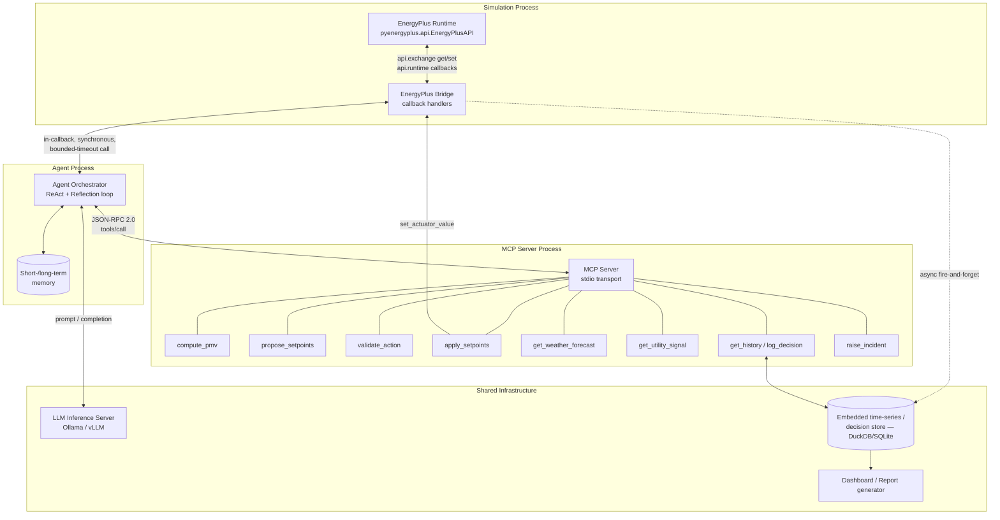
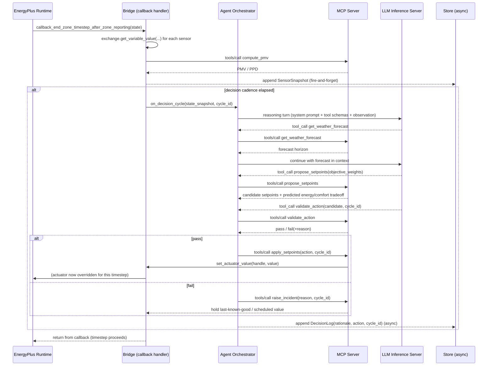
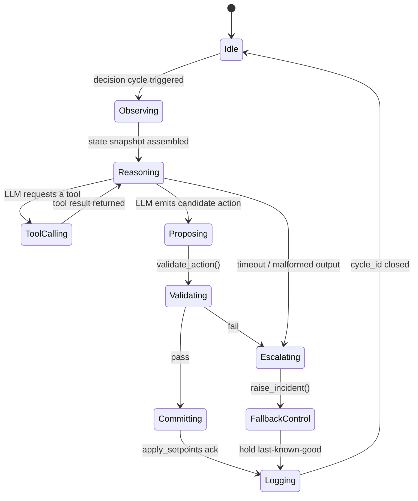
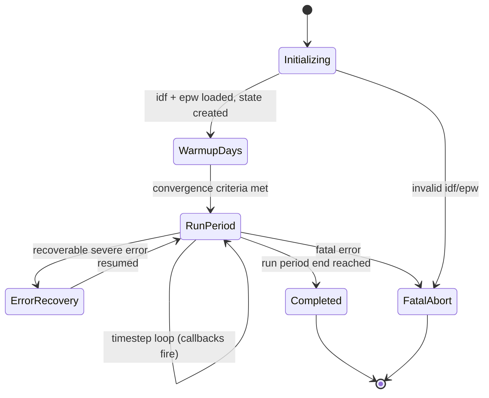
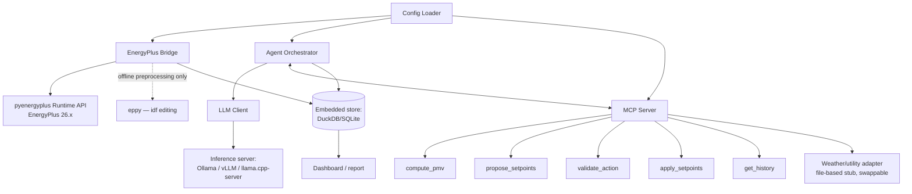

# 02 — Architecture

## 1. Architectural style: in-process callback core, tool-mediated periphery

The single hardest architectural fact about this system is this: **EnergyPlus's Python Runtime API is callback-driven and synchronous.** When EnergyPlus reaches a registered calling point (e.g., end of a zone timestep), it calls your Python function and *blocks its own execution* until that function returns. This is confirmed directly by NREL/DOE's own documentation of the Runtime API ("create a callback function in Python, and register it... the client can get sensor values and set actuator values" from within that call, which EnergyPlus waits on).

This single fact resolves a decision that would otherwise look like it needs a complex async/queue-based architecture: **because EnergyPlus is not real-time (it is a discrete-event simulator with no wall-clock deadline of its own), a callback is allowed to take several seconds of wall-clock time — including making a network call to an LLM — without breaking anything**, as long as that latency is acceptable to the humans watching the demo. This is different from, say, a real BMS control loop with an actual hard real-time deadline.

The architecture therefore has two very different halves:

- **The core control loop is synchronous and in-process-adjacent**: EnergyPlus calls the Bridge; the Bridge, still inside that callback, invokes the Agent Orchestrator; the Agent Orchestrator calls out to the MCP server and the LLM; a validated result is written back to the actuator before the callback returns. No queue is needed for *this* path because EnergyPlus is already, itself, the thing enforcing ordering and blocking.
- **Everything that is not on that critical path — logging, dashboard updates, long-horizon reflection — is asynchronous and decoupled**, specifically so that slow I/O (a database write, a UI refresh) never adds latency to the simulation loop or, worse, risks corrupting simulation state if it fails.

This "synchronous core, async periphery" split is the organizing principle behind every component boundary below, and is recorded formally as `17_Architecture_Decision_Records.md`, ADR-007.

## 2. High-level component diagram

## 3. Why this architecture — and why not the alternatives

### 3.1 Why the Python Runtime API as the integration point (not EMS/Erl, not a Python Plugin, not BCVTB/FMU)

| Option | Verdict | Why |
|---|---|---|
| **Python Runtime API** (`pyenergyplus.api.EnergyPlusAPI`, external script) | **Chosen** | First-party, actively maintained by NREL/DOE across current releases; runs as an ordinary external Python process that can import any library (an HTTP client to an LLM server, an MCP client, a DB driver) with no sandboxing restrictions; explicitly designed for exactly this "external controller" use case. |
| EMS (Erl — EnergyPlus Runtime Language) | Rejected as the control mechanism | Erl is EnergyPlus's *internal* scripting language, edited inside the `.idf` text itself. It cannot make an HTTP call to an LLM server, cannot import an MCP client, and is not a general-purpose language — it exists for lightweight in-simulation logic, not for hosting an AI agent. We *do* rely on the same underlying Actuator/Sensor concept EMS uses (the Python API's `get_actuator_handle`/`set_actuator_value` operate on the same actuator list EMS would), just driven from Python instead of Erl. |
| Python Plugin system (`PythonPlugin:Instance` objects referenced from the `.idf`) | Rejected | This runs your Python *inside* EnergyPlus's plugin manager, coupling your control code to the specific `.idf` it's declared in and to EnergyPlus's plugin lifecycle. The external Runtime API script achieves the same data access with a normal, independently testable Python process that isn't declared inside the building model at all — better separation of concerns, and it's the pattern EnergyPlus's own external-control examples use. |
| BCVTB (Building Controls Virtual Test Bed) | Rejected for this use case | BCVTB is a genuinely useful, LBNL-maintained co-simulation *middleware* — but it exists to link EnergyPlus to **other simulators** (Modelica/Dymola HVAC models, MATLAB/Simulink), via a Ptolemy-II-based socket protocol. It adds a JVM/Ptolemy dependency and a socket-based data-exchange layer for a problem we don't have (we are not coupling to another *simulator*, we are coupling to a *decision-making process*). The Python Runtime API talks to that decision-making process directly, in-process-adjacent, with none of BCVTB's middleware overhead. |
| EnergyPlusToFMU / FMU export | Rejected for this use case | FMU export is the right tool when some *other* FMI-compliant tool (Modelica, Dymola, an HVAC-specific solver) needs to drive or be driven by EnergyPlus. Our "other tool" is an LLM agent talking JSON-RPC over MCP, which has no FMI relationship to speak of — wrapping it in an FMU would add a translation layer with no benefit. Spawn-of-EnergyPlus (DOE's Modelica-based next-generation engine, which leans on FMI internally) is the right lineage to watch for a future where HVAC dynamics themselves need finer-grained physical modeling than EnergyPlus's quasi-steady-state timestep model — out of scope here. |

This reasoning is recorded formally in `17_Architecture_Decision_Records.md`, ADR-002, and the API surface itself is detailed in `07_EnergyPlus_Design.md`.

### 3.2 Why MCP as the tool-calling boundary (not a custom REST API, not in-process function calling)

| Option | Verdict | Why |
|---|---|---|
| **MCP server**, tools exposed via JSON-RPC 2.0 | **Chosen** | (1) It's an explicit project requirement. (2) It gives a hard process boundary between "what the LLM can do" and "how it's implemented" — the LLM only ever sees tool schemas and results, never the Bridge's internals, which is a real security property (least privilege), not just an abstraction preference. (3) It is transport-agnostic (stdio locally now; Streamable HTTP later if the agent and tool server are split across hosts) without changing the tool contracts. (4) The MCP specification's built-in distinction between **protocol-level errors** (malformed call, unknown tool — standard JSON-RPC error) and **tool-execution errors** (`isError: true` inside a normal result) is exactly the mechanism this system needs: it lets the agent *see and reason about* a failed `propose_setpoints` call instead of the call just vanishing into an exception. |
| Ad hoc Python function-calling (e.g., LLM SDK's native "tools" parameter, functions defined in-process) | Rejected | Works, but ties the tool implementation to one LLM SDK's calling convention and removes the process boundary — a bug in a tool implementation can now directly corrupt agent-process memory instead of failing at a well-defined RPC boundary. Harder to swap LLM backend later without rewriting the tool-calling glue. |
| Custom REST API + OpenAPI schema | Rejected | Reinvents most of what MCP already standardizes (schema-typed calls, discovery via `tools/list`, structured errors) with none of the ecosystem benefit (existing MCP clients/hosts can already talk to this server unmodified) and without MCP's tool-annotation trust model (`14_Security.md`, §2). |

As of this writing, the current published MCP specification revision is **2025-11-25**; a release candidate dated **2026-07-28** is locked for SDK validation and due to finalize on that date (three days after this document's date), and its headline change — a stateless rework of Streamable HTTP plus mandatory routing headers — is a **transport**-layer change only and does not alter the tools/resources/prompts contracts this system depends on. This spec targets stdio transport for the PoC (single host, lowest latency, zero networking to secure) and calls out Streamable HTTP as the documented upgrade path if the MCP server is ever split onto its own host — see `09_MCP_Architecture.md`, §1, and `17_Architecture_Decision_Records.md`, ADR-003.

### 3.3 Why a hybrid LLM-supervisor + deterministic-optimizer control core (summary; full argument in `06_Control_System.md`)

The brief's language ("the LLM computes optimal ECMs... updates dynamic building setpoints") could be read as "the LLM does the numeric optimization." This spec deliberately does not build it that way. LLM token generation is not a reliable numeric optimizer, and asking one to *be* the control law directly conflicts with the rubric's own "hallucination prevention" testing requirement. Instead:

- A small, deterministic optimizer (a bounded search or short-horizon heuristic over the allow-listed actuator ranges) is exposed as the `propose_setpoints` **tool**.
- The LLM's job is supervisory: decide *when* to invoke it, *with what objective weighting* given current conditions (comfort risk, price/carbon signal, forecast), *interpret* the numeric result in context, and *explain* the decision — not to compute the setpoint arithmetic itself.
- A separate, non-LLM `validate_action` tool is the final, non-negotiable gate.

This is argued in full, with rejected alternatives (pure MPC, pure RL, pure end-to-end LLM, PID, Bayesian optimization) and cited evidence, in `06_Control_System.md`.

## 4. Component interactions and data flow (overview — full detail in `04_Dataflow.md`)

1. EnergyPlus reaches a registered calling point once per zone timestep.
2. The Bridge reads sensor/meter values via `api.exchange`, computes derived quantities (via `compute_pmv`), and — only on decision-cadence boundaries, not every timestep — hands control to the Agent Orchestrator, synchronously, with a bounded timeout.
3. The Agent Orchestrator runs a ReAct-style loop against the LLM, calling MCP tools as needed (forecast, history, propose, validate).
4. On success, `apply_setpoints` writes the actuator value through the Bridge back into EnergyPlus before the callback returns; on failure/timeout, the fallback path (last known-good / scheduled value) is used instead, and `raise_incident` fires.
5. Regardless of outcome, a decision record is pushed asynchronously to the store; the dashboard reads from the store, never from the live simulation directly.

## 5. Sequence diagram — one decision cycle

## 6. State diagrams

**Agent Orchestrator, per cycle:**

**Simulation lifecycle:**

## 7. Dependency graph

## 8. Technology justification (summary table; full ADRs in `17_Architecture_Decision_Records.md`)

| Layer | Choice | One-line justification |
|---|---|---|
| Language | Python | First-party `pyenergyplus`/`eppy`; brief's stated preference; rich MCP SDK support |
| Simulation coupling | Python Runtime API | §3.1 above |
| Tool protocol | MCP, stdio transport | §3.2 above |
| LLM serving | Self-hosted OSS model via Ollama/vLLM-class server, native or grammar-constrained tool calling | Required by brief; constrained decoding addresses syntax reliability (`08_LLM_and_Agent_System.md`) |
| Control core | Hybrid: LLM supervisor + deterministic optimizer tool + deterministic validator | §3.3 above, full argument `06_Control_System.md` |
| Storage | DuckDB (or SQLite) embedded, with a documented TimescaleDB migration path | `11_Database_Design.md` |
| Dashboard | Static/local web app reading from the store | Simplicity for PoC; no operational surface beyond the file itself |

## 9. What this architecture explicitly does not decide

Per `00_Project_Overview.md`'s scoping principle, this document does not specify: multi-host deployment topology, authentication/authorization for a multi-tenant MCP server, or a production on-call/alerting stack. The seams for all three exist (MCP transport swap, config-driven actuator allow-lists, structured incident logs respectively) but building them out is explicitly future work, tracked in `16_Risk_Register.md`.
