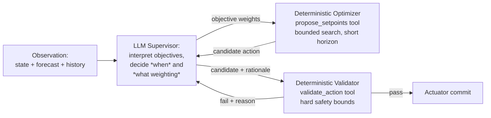

# 06 — Control System

This is the document where "reject inferior approaches" has to be earned with evidence, not asserted. Each strategy below is evaluated on the same axes: what it needs to work, what it's demonstrated in the literature, and specifically why it is or isn't the right fit for *this* system's constraints (open-source LLM required, PoC timeline, simulation-only safety envelope, rubric explicitly rewarding both agentic autonomy and hallucination prevention).

## 1. The seven candidates

### 1.1 PID (Proportional-Integral-Derivative)

PID is a single-loop, reactive, model-free feedback controller. It is the workhorse of low-level HVAC actuation (valve/damper position, discharge-air temperature trim) precisely because it needs no model of the building and is cheap to tune for a single, well-behaved loop.

**Why it's rejected as the supervisory strategy here**: PID has no forecast/lookahead, cannot express multi-variable trade-offs (comfort vs. energy vs. demand charges), and cannot represent the qualitative, context-dependent reasoning the rubric explicitly wants ("Agentic Autonomy," "self-correction"). This is not a knock on PID in general — it remains the right tool for the low-level loops *inside* an HVAC system — but it answers a different question than the one this project is asking. **Verdict: retained implicitly at the equipment-controller level (outside this project's scope), rejected as the supervisory strategy.**

### 1.2 Rule-based control (traditional BMS)

Fixed schedules and if-then logic. Transparent and cheap, but this is explicitly the status quo the brief frames the whole project as improving on ("Traditional Building Management Systems... rely on rigid, rule-based schedules that fail to adapt dynamically"). **Verdict: rejected as the primary strategy, retained as the fallback/fail-safe controller** — its predictability is exactly what you want when the AI path fails (FR-8, `01_Requirements.md`).

### 1.3 Model Predictive Control (MPC)

MPC optimizes a control sequence over a receding horizon using a model of building thermal dynamics plus forecasts (weather, occupancy), re-solving every step. This is the most mature "advanced control" approach in the building literature. A widely cited synthesis of the field (Drgoňa et al., *Annual Reviews in Control*, 2020) pulls together results from numerous simulation studies and several real pilot deployments and reports that MPC's combination of comfort improvement and energy reduction tends to land somewhere in a 15%–50% range depending on the building and baseline being compared against — one of the foundational data points in that synthesis being the 2012 field/simulation comparison by Oldewurtel et al. (*Energy and Buildings* 45:15–27). This is a genuinely strong, reproducible evidence base — stronger than either RL or LLM control below.

**Why it's not the sole strategy here**: MPC needs a (possibly reduced-order) dynamics model and a solvable optimization formulation; building and validating that model is itself real engineering work, and doing it well is somewhat orthogonal to what the brief is actually asking to be demonstrated (an LLM-and-MCP-driven agentic loop). MPC alone also does not satisfy the rubric's explicit requirement for LLM tool-calling and autonomous reasoning — a pure-MPC system would score zero on "Agentic Autonomy" (15% of the grade) regardless of its energy performance. **Verdict: rejected as the sole strategy, but its core idea — a numeric optimizer solving over a bounded horizon — is retained as the deterministic "muscle" behind the `propose_setpoints` tool** (§4 below), which is a lightweight, short-horizon relative of full MPC rather than a from-scratch alternative to it.

### 1.4 Reinforcement Learning (RL)

RL learns a control policy from interaction (simulated or real) without requiring an explicit dynamics model. The literature here is larger but more uneven than MPC's:

- A frequently cited survey of RL applications in building energy management (Mason and Grijalva) found that reported savings vary a lot by application: roughly a tenth of energy use for HVAC-specific control, closer to a fifth for water heating, and sometimes better than that when RL is applied at the whole-building level — a real, positive, but more modest and more variable range than MPC's demonstrated ceiling.
- Critically, a 2025 review tracing field deployments of MPC and RL controllers points out that the earlier reviews in this space kept running into the same problem: almost all of the reported RL results came from simulation only, and because every study used a different simulation setup and evaluation method, comparing results across papers was unreliable. This gap between simulation results and field-validated results is a real, evidence-backed reason for caution, not a rhetorical one.
- The most-cited "success story" for RL in a building-adjacent setting is DeepMind's data-center cooling work: a **40% reduction in cooling energy, translating to a 15% reduction in overall PUE overhead**, reported by Evans and Gao on Google's own engineering blog in 2016. This is a real, large effect — but it is worth being precise about what it is: a **corporate blog post announcing a live-deployment result, not a peer-reviewed paper**, and the subsequent peer-reviewed follow-up work from the same team (Lazic et al., "Data center cooling using model-predictive control," NeurIPS Workshop, 2018) deliberately moved toward a **safety-constrained, model-based** approach rather than end-to-end model-free RL for exactly the reason this document cares about: unconstrained learned policies are hard to certify safe on real infrastructure. That the follow-up academic work added explicit safety constraints is itself evidence for this project's own design choice (§4).

**Why it's not the primary strategy here**: training a policy — even offline, even in simulation — is a multi-week undertaking with real risk of an unsafe or simply bad policy during exploration, and RL training is explicitly out of scope per `00_Project_Overview.md` §3.2 ("no fine-tuning or RL policy training"). **Verdict: rejected for the PoC's control path. Retained as a named, documented future-work direction** (an offline RL or RL-MPC hybrid policy — see Arroyo et al., "Reinforced model predictive control (RL-MPC) for building energy management," *Applied Energy* 309, 2022, for exactly this combination — trained against the same EnergyPlus model once the PoC's baseline is established) — not built in this phase.

### 1.5 Pure end-to-end LLM control

The brief's literal language ("the LLM computes optimal ECMs... updates dynamic building set-points") could be read as: the LLM itself performs the numeric optimization and emits final setpoints with no separate solver.

**Why this is rejected outright**: LLM token generation is not a reliable numeric optimizer — nothing in how these models are trained gives a guarantee of arithmetic correctness or constraint satisfaction, and the failure mode (a plausible-sounding but wrong number landing on a real actuator) is exactly the hallucination risk the rubric explicitly asks this project to test against ("Hallucination Prevention" in `13_Testing.md`). This is reinforced by current practitioner guidance on structured LLM output: grammar- or schema-constrained decoding is good at eliminating malformed syntax, but it operates purely on the *shape* of the output — it has no way to check whether the *values* inside that shape are actually correct, so a well-formed JSON object can still carry a wrong number. No amount of output-formatting discipline solves the underlying reliability problem for a numeric control law. **Verdict: rejected as the control mechanism. Retained as the supervisory/reasoning layer around a separate deterministic solver** — this is the crux of §4.

### 1.6 Bayesian Optimization (BO)

BO is a sample-efficient, gradient-free global optimizer well suited to problems where each evaluation (a real or simulated trial) is expensive and the parameter space is low-to-moderate dimensional. In buildings specifically, it has two well-evidenced but *different* roles from real-time control:

1. **Control-parameter/schedule tuning**: one published BO-based HVAC control framework, validated on a simulation calibrated against real data-center trend logs, improved on the site's existing automation baseline by more than 10% in energy efficiency after only a few weeks of on-the-fly optimization — a meaningfully fast payback for a technique that needs no training data up front.
2. **Model calibration**: BO is a well-established technique specifically for calibrating building/HVAC simulation model parameters against measured data (multiple independent papers on Bayesian calibration of coupled building-HVAC dynamics), because it is data-efficient and doesn't require differentiating through the simulator.

**Why it's not the real-time control mechanism here**: BO proposes one (or a small batch of) evaluation points at a time and improves *between* trials over many iterations — it is suited to slow, offline tuning, not a sub-minute reactive decision loop. **Verdict: rejected for the online control loop; retained for two specific offline uses** — (a) tuning the deterministic optimizer's own parameters/objective weights before a demo run, and (b) as the recommended technique if this project is ever extended to calibrate a reduced-order thermal model against real building data (a natural next step toward MPC, per §1.3).

### 1.7 Digital Twin

In the strict sense used elsewhere (a live-synchronized virtual replica of a real asset, continuously updated from real sensor data), a digital twin is not what this project builds — there is no real building to synchronize against (`00_Project_Overview.md` §3.2). However, the EnergyPlus model **functions as** the digital twin *for this PoC's purposes*: it is the stand-in physical plant against which every control decision is tested. **Verdict: the EnergyPlus model is the de facto digital twin of this phase; a true production digital twin (continuously calibrated against real telemetry, likely using the BO-based calibration technique from §1.6) is named as the natural next phase, not built here.**

## 2. The recommendation: hybrid, LLM-supervised, deterministic-core



**The division of labor, stated as a rule**: the LLM decides *whether* to act, *what to optimize for* given current context (a judgment call informed by forecast, price/carbon signals, and past outcomes — exactly the kind of contextual, qualitative reasoning LLMs are good at), and *how to explain* the outcome. The arithmetic of "what set-point actually minimizes energy subject to the comfort constraint" is delegated to a small, deterministic, testable optimizer, and the final safety check is a separate, non-negotiable deterministic gate that does not trust either of the other two.

**Why this beats every single-strategy alternative above, stated directly**:

- It is the only option that satisfies the brief's explicit requirement for genuine LLM tool-calling and autonomous reasoning (rules out 1.1, 1.3, 1.4, 1.6 as *sole* strategies).
- It does not ask an LLM to be a numeric optimizer (rules out 1.5 as designed literally).
- It does not require training a policy inside the PoC timeline (rules out 1.4 as the primary mechanism).
- It reduces to something auditable and testable — the optimizer and validator are ordinary deterministic code, fuzzable and property-testable (`13_Testing.md`), independent of whatever the LLM says.
- It is consistent with the one clear lesson visible across *every* serious real-world deployment surveyed above — DeepMind's own follow-up work moving from a blog-post-level pure-ML result to a peer-reviewed, safety-constrained model-based approach, RL-MPC hybrids appearing repeatedly in the recent literature (Arroyo et al., 2022), and BO being paired with reference models rather than used blind — is that **the mature, evidence-backed pattern is "learned/generative layer proposes, constrained/model-based layer verifies," not "one method does everything end to end."** This project's architecture is that pattern, applied with an LLM in the generative-layer role because that is what the assignment specifies.

## 3. What "optimal" means operationally

The optimizer's objective, computed by `propose_setpoints` and only ever *weighted* (not authored) by the LLM, is:

```
minimize:  w_energy · predicted_kWh(horizon)
subject to:
  PMV(t) ∈ [-1.5, +1.5]  for all t in horizon        (hard — CC-2)
  demand(t) ≤ peak_threshold, if configured           (hard — EC-2)
  setpoint(t) ∈ allow-listed bounds                   (hard — SR-1)
soft-prefer:
  PMV(t) ∈ [-0.5, +0.5]                                (target — CC-1, penalized not forbidden)
  carbon_intensity-weighted load shift, if enabled     (EC-3)
```

`w_energy` and the soft-preference penalty weight are the two knobs the LLM is actually allowed to move, per cycle, based on its read of context (e.g., "forecast shows falling outdoor temp and rising grid carbon intensity — bias toward comfort this cycle, energy next cycle"). This keeps the LLM's leverage exactly where its qualitative judgment is useful and nowhere near the arithmetic.

## 4. Rejected combination: LLM-only with "careful prompting" instead of a separate validator

An earlier framing of this system considered relying entirely on careful prompting (e.g., "always check your setpoint is within bounds before responding") instead of a separate, code-level `validate_action` gate. This is explicitly rejected: prompting is a request, not a constraint, and the entire point of the deterministic core is that safety does not depend on the LLM choosing to comply. This mirrors current practitioner consensus on structured output discussed in §1.5, and is treated as non-negotiable in `01_Requirements.md` (SR-1–SR-4) and `14_Security.md`.
