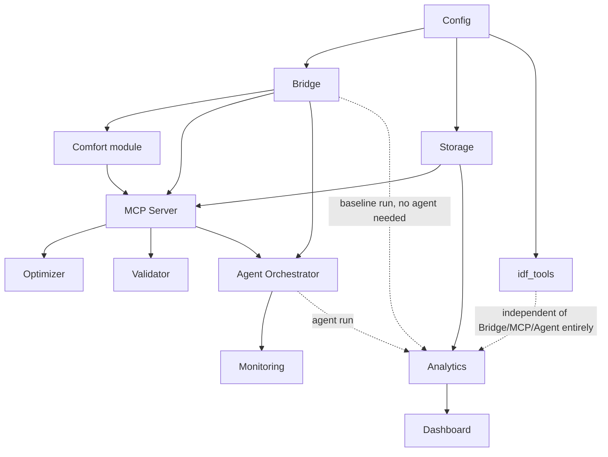

# IMPLEMENTATION_DEPENDENCY_GRAPH.md

This graph shows **build dependencies** (what must exist, at least in a testable form, before the next component can be built against it) — distinct from `02_Architecture.md`'s component diagram, which shows **runtime data flow**. The two agree on what talks to what; they differ because build order and runtime call order are not the same thing (e.g., at runtime the Agent calls the MCP Server, but the MCP Server's tool implementations must be built *referencing* the Bridge and Storage, which is why those appear as build-time dependencies of the MCP Server below, not the reverse).

## Full graph

## Reading the graph

- **Config is the only component with no build-time dependency.** Everything else either reads config directly or depends on something that does.
- **Bridge and Storage are build-time siblings**, not sequential — both depend only on Config, and can be built in parallel by two engineers. The example ordering in `IMPLEMENTATION_ROADMAP.md` (Bridge before Storage) reflects a *staffing* choice for a single-engineer or small-team build, not a hard graph dependency; the graph itself permits either order or true parallelism.
- **The MCP Server is the first component with a wide fan-in**: its ten tools reference the Bridge (`get_zone_state`, `apply_setpoints`), Storage (`get_history`, `log_decision`, `raise_incident`), the Comfort module (`compute_pmv`), the Optimizer (`propose_setpoints`), and the Validator (`validate_action`) — it cannot be meaningfully build-complete until all five exist, even in stub form.
- **The Agent Orchestrator depends only on the MCP Server and the Bridge** (the latter for the `on_decision_cycle` hook it's invoked through) — it does not depend on the Optimizer, Validator, or Comfort module *directly*, because those are reached exclusively through MCP tool calls, never imported directly. This is the same import-boundary property `TRACEABILITY_MATRIX.md` (FR-4 row) requires be enforced in CI.
- **`idf_tools` is fully disconnected from the Bridge/MCP/Agent subgraph** except through Config — it can be built at any point after Stage 1 with zero coordination cost against the rest of the build.
- **Analytics depends only on Storage**, not on the Agent — a baseline-only run (Bridge + Storage, no Agent) already produces enough data for Analytics to compute half of the FR-9 comparison; the agent-run half arrives once the Agent Orchestrator exists.
- **Monitoring depends on the Agent Orchestrator**, not the reverse — health/incident visibility is meaningful only once there's a decision loop capable of generating incidents.

## Explicit non-dependencies (stated because absence-of-dependency is as important as presence)

| Component | Does NOT depend on (at build time) | Why this matters |
|---|---|---|
| Bridge | MCP Server, Agent, Storage | Bridge must be independently testable against a stub telemetry sink (`03_Component_Design.md` NFR-1) |
| Validator | Agent, LLM client, MCP Server's other tools | Validator is a pure function of config + candidate action; it must be testable with zero LLM involvement (`13_Testing.md` §2, §8) |
| Optimizer | Agent, LLM client | Same reasoning as Validator — the deterministic core must be provably independent of the LLM (ADR-005) |
| Dashboard | Bridge, MCP Server, Agent, LLM client | Dashboard is a pure read-side consumer of Analytics/Storage (`03_Component_Design.md` §8) — it should be fully buildable and testable against a fixture dataset with no live simulation running at all |
| idf_tools | Bridge, MCP Server, Agent, Storage | Confirmed above — `07_EnergyPlus_Design.md` §4's "two different mechanisms" principle, made concrete as a build-graph fact |

## Cycle check

No cycle exists in the graph above: every arrow points from something with fewer transitive dependents in the reverse direction to something with more. Config → {Bridge, Storage, idf_tools} → {Comfort, MCP} → {Optimizer, Validator, Agent} → {Monitoring, Analytics} → Dashboard is a strict topological order; nothing later in that chain is a build-time dependency of anything earlier in it.
