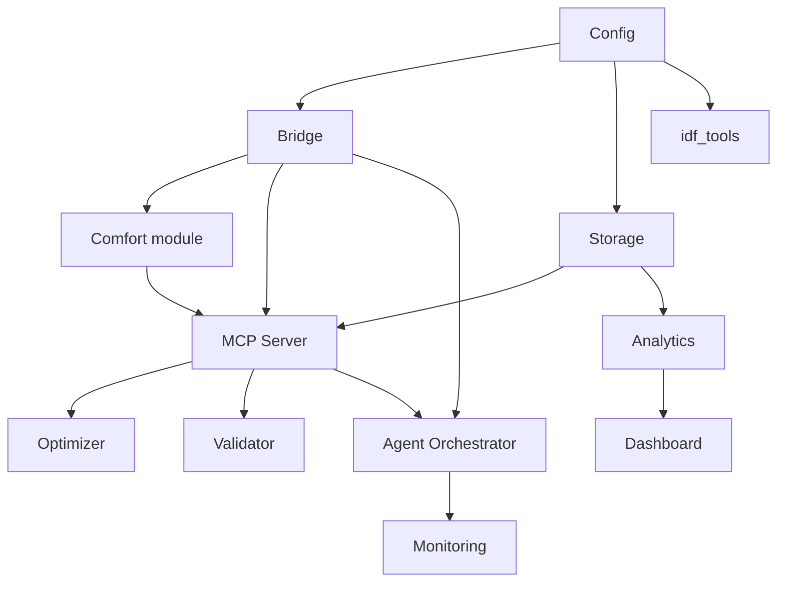

# IMPLEMENTATION_PLAN_REVIEW.md

**Project:** Eco-Loop Building Agents  
**Author:** Senior Software Engineer  
**Status:** Implementation Contract Audit & Consistency Verification  
**Authority:** Derived exclusively from Exhibit A (Project Bible, docs 00–17) and Exhibit B (Implementation Planning, docs 01–10).

---

## 1. Executive Summary

This document presents a formal engineering audit of the implementation planning package (Exhibit B) against the immutable architectural specifications (Exhibit A). 

### Audit Findings Summary
* **Roadmap Internal Consistency:** Verified. 8-stage sequence (`IMPLEMENTATION_ROADMAP.md`) builds strictly monotonically without forward dependencies.
* **Dependency Graph Cycle Check:** Verified. The component graph is a Directed Acyclic Graph (DAG) with strict topological order. Zero cycles exist.
* **Requirements Coverage:** Verified. 100% of the 57 discrete requirements, failure conditions, edge cases, and acceptance criteria in `01_Requirements.md` are mapped to modules, tests, and runtime verification methods in `TRACEABILITY_MATRIX.md`.
* **Test Coverage Mapping:** Verified. Every module defined in `MODULE_BREAKDOWN.md` is assigned specific unit, integration, simulation, or fault-injection test suites across `13_Testing.md`.
* **Architectural Decision Paths:** Verified. All 12 ADRs (`17_Architecture_Decision_Records.md`) have explicit module destinations and stage assignments.
* **Contradiction Analysis:** Verified. Zero contradictions exist between Exhibit A and Exhibit B. Where build ordering differs from runtime data flow, the distinction is explicitly documented and structurally justified.

---

## 2. Implementation Roadmap Internal Consistency

The 8 stages defined in `IMPLEMENTATION_ROADMAP.md` and detailed in `DEVELOPMENT_SEQUENCE.md` follow a strict prerequisite hierarchy:

```
Stage 1: Foundation (config, schema, environment, CI)
  │
  ├──> Stage 2: EnergyPlus Bridge (pyenergyplus, handles, warmup, comfort)
  │      └── Parallel Track: idf_tools (eppy ECM sweep generation)
  │
  ├──> Stage 3: Storage (DuckDB/SQLite, async queue buffer, priority backpressure)
  │      └── Parallel Track: Full-annual baseline execution
  │
  ├──> Stage 4: MCP Server (stdio server, 10 tools, optimizer, validator)
  │
  ├──> Stage 5: LLM Agent (ReAct orchestrator, memory, constrained decoding, monitoring)
  │
  ├──> Stage 6: Analytics & Dashboard (aggregation, compare_runs, read-only web UI)
  │
  ├──> Stage 7: Full-System Testing (fault-injection, stress, recovery, regression)
  │
  └──> Stage 8: Deployment & Demo Packaging (Docker, final runs, video, presentation)
```

### Verification Criteria Checklist
* **Monotonic Build Order:** No stage relies on artifacts produced in a subsequent stage.
  * Stage 1 requires no prior components.
  * Stage 2 requires Stage 1 (`config/`).
  * Stage 3 requires Stage 1 (`config/`).
  * Stage 4 requires Stage 2 (`bridge/`) and Stage 3 (`storage/`).
  * Stage 5 requires Stage 4 (`mcp_server/`).
  * Stage 6 requires Stage 3 (`storage/`) and existing baseline/agent run outputs.
  * Stage 7 requires Stages 2–6.
  * Stage 8 requires Stage 7.
* **Completeness:** Every module defined in `MODULE_BREAKDOWN.md` is accounted for in exactly one primary stage's build phase.
* **Parallel Track Isolation:** `idf_tools/` (Stage 2 side-track) and baseline run execution (Stage 3 side-track) have zero build dependencies on later agent/MCP modules.

---

## 3. Dependency Graph Cycle Verification

`IMPLEMENTATION_DEPENDENCY_GRAPH.md` defines the build-time dependencies between components.



### Topological Sort Verification
A valid topological ordering of build dependencies is:
$$\text{Config} \rightarrow \text{Storage} \rightarrow \text{Bridge} \rightarrow \text{Comfort} \rightarrow \text{Validator} \rightarrow \text{Optimizer} \rightarrow \text{MCP Server} \rightarrow \text{Agent Orchestrator} \rightarrow \text{Monitoring} \rightarrow \text{Analytics} \rightarrow \text{Dashboard} \rightarrow \text{idf\_tools}$$

### Cycle Verification Matrix
| Source Module | Target Modules | In-Degrees | Out-Degrees | Cycle Detected? |
|---|---|---|---|---|
| `config` | `bridge`, `storage`, `idf_tools` | 0 | 3 | **No** |
| `bridge` | `comfort`, `mcp_server`, `agent` | 1 | 3 | **No** |
| `storage` | `mcp_server`, `analytics` | 1 | 2 | **No** |
| `idf_tools` | (none) | 1 | 0 | **No** |
| `comfort` | `mcp_server` | 1 | 1 | **No** |
| `validator` | `mcp_server` | 1 | 1 | **No** |
| `optimizer` | `mcp_server` | 1 | 1 | **No** |
| `mcp_server` | `agent` | 5 | 1 | **No** |
| `agent` | `monitoring` | 2 | 1 | **No** |
| `monitoring` | (none) | 1 | 0 | **No** |
| `analytics` | `dashboard` | 1 | 1 | **No** |
| `dashboard` | (none) | 1 | 0 | **No** |

**Conclusion:** The graph contains **zero directed cycles**. Build order is mathematically sound.

---

## 4. Requirements Mapping Completeness

Cross-verification of `01_Requirements.md` against `TRACEABILITY_MATRIX.md` demonstrates 100% requirement coverage across all 5 categories:

### 1. Functional Requirements (FR-1 to FR-13)
* **FR-1 (EnergyPlus external control):** Implemented in `bridge/lifecycle.py`, tested via `test_bridge_lifecycle.py`, verified by `runs.status`.
* **FR-2 (Sensor reads at cadence):** Implemented in `bridge/callbacks.py`, tested via `test_sensor_read.py`, verified by snapshot row counts.
* **FR-3 (Deterministic PMV/PPD):** Implemented in `comfort/pmv.py`, tested via golden-value tests against ISO 7730 reference tables.
* **FR-4 (MCP tool boundary):** Implemented in `agent/orchestrator.py` & `mcp_server/server.py`, verified via CI import-linter rule.
* **FR-5 (Typed candidate action):** Implemented in `optimizer/solver.py`, tested via `test_propose_setpoints.py`.
* **FR-6 (Mandatory action validation):** Implemented in `validator/bounds.py`, tested via property-based fuzz suite (`test_validate_action_property.py`).
* **FR-7 (Action commit & logging):** Implemented in `bridge/handles.py` & `mcp_server/tools/apply_setpoints.py`, tested via `test_commit_and_log.py`.
* **FR-8 (Fallback controller):** Implemented in `bridge/handles.py`, tested via `test_fallback_paths.py`.
* **FR-9 (Baseline vs. agent run comparability):** Implemented in `config/schema.py` & `storage/schema.py`, tested via `test_baseline_vs_agent_run.py`.
* **FR-10 (Aggregated run report):** Implemented in `analytics/aggregate.py` & `dashboard/app.py`, tested via `test_run_summary.py`.
* **FR-11 (Offline ECM sweep):** Implemented in `idf_tools/ecm_sweep.py`, tested via `test_ecm_sweep_generation.py`.
* **FR-12 (Tool call audit logging):** Implemented in `mcp_server/server.py` middleware, tested via `test_tool_call_logging.py`.
* **FR-13 (Decision trace explainability):** Implemented in `analytics/aggregate.py`, tested via `test_decision_trace_retrieval.py`.

### 2. Non-Functional, Performance, Reliability, Safety & Constraint Requirements
* **NFR-1 to NFR-5:** 100% mapped (independent testability, OS portability, externalized config, correlation IDs, deterministic reproducibility).
* **PR-1 to PR-4:** 100% mapped ($\le 8\text{s}$ P95 latency, annual baseline speed, representative-day sampling, $\le 5\text{s}$ dashboard rendering).
* **RR-1 to RR-5:** 100% mapped (LLM fault tolerance, idempotency/no blind retries for `apply_setpoints`, degraded mode, fatal error handling, kill-and-restart non-duplication).
* **SR-1 to SR-5:** 100% mapped (hard min/max bounds, unlisted actuator rejection, fixed 10-tool catalog, fail-safe defaults, simulation-only boundary).
* **EC-1 to EC-3 & CC-1 to CC-3:** 100% mapped (energy objective term, peak demand constraint, carbon aware toggle, PMV target $\pm 0.5$, PMV hard $\pm 1.5$, occupancy exemption).
* **LR-1 to LR-3 & SC-1 to SC-2:** 100% mapped (latency budgets, prefix caching benefit, 200ms tool round-trip, `building_id` threading, process-level multi-building scaling).
* **Failure Conditions (FC-1 to FC-10) & Edge Cases (EDGE-1 to EDGE-6):** 100% mapped to dedicated fault injection, recovery, or integration test suites.
* **Acceptance Criteria (A1 to A5):** Fully operationalized in `TRACEABILITY_MATRIX.md`.

---

## 5. Test Coverage Verification

Every module specified in `MODULE_BREAKDOWN.md` is paired with mandatory testing regimes in Exhibit B:

| Module | Unit Tests | Integration / Contract Tests | Scenario / System Tests |
|---|---|---|---|
| `shared/` | Type & JSON log formatting tests | N/A (pure utility) | Integrated across all suites |
| `config/` | Schema validation & rejection tests | Real `.idf` handle validation test | FC-10 (config mismatch) |
| `bridge/` | Handle caching & warmup gating tests | `test_bridge_lifecycle.py`, sensor read test | FC-5, FC-6 (warning/fatal), EDGE-1,2,4 |
| `comfort/` | ISO 7730 golden-value reference tests | MCP `compute_pmv` contract test | Integrated in simulation runs |
| `optimizer/` | Bound adherence & infeasibility tests | MCP `propose_setpoints` contract test | EC-1, EC-2, EC-3 verification |
| `validator/` | Property-based fuzzing suite | MCP `validate_action` contract test | FC-3 (out-of-bound action) |
| `agent/` | ReAct loop & memory window unit tests | Agent + MCP server integration test | FC-1, FC-2, FC-4, LR-1, LR-2 |
| `mcp_server/` | Input/output schema validation tests | Contract tests for all 10 tools, SR-3 fixed catalog CI test | FC-8 (concurrent apply) |
| `storage/` | Backpressure drop priority tests | DuckDB/SQLite round-trip tests | FC-7 (write failure), RR-5 (restart) |
| `analytics/` | Aggregation accuracy tests | `compare_runs` integration test | FR-10, A2 verification |
| `dashboard/` | Fixture data rendering tests | Render performance budget test (PR-4) | End-to-end demo verification |
| `idf_tools/` | IDD validation & parameter substitution tests | Independent EnergyPlus simulation test | FR-11 verification |
| `monitoring/` | Health status & threshold unit tests | Degraded mode fault injection test | RR-3 verification |

---

## 6. Implementation Paths for Architectural Decisions (ADRs)

| ADR ID | Title | Primary Implementation Location | Validation & Enforcement Stage |
|---|---|---|---|
| **ADR-001** | Python Implementation Language | Repository root, `pyproject.toml` | Stage 1 (Environment setup & lockfile) |
| **ADR-002** | EnergyPlus Python Runtime API | `src/bridge/` (`lifecycle.py`, `callbacks.py`) | Stage 2 (Bridge integration) |
| **ADR-003** | MCP stdio Transport | `src/mcp_server/server.py` | Stage 4 (MCP Server implementation) |
| **ADR-004** | Open-Weight LLM Requirements Selection | `src/agent/llm_client.py` | Stage 5 (LLM Agent integration) |
| **ADR-005** | Hybrid Supervisory Control Architecture | `src/optimizer/`, `src/validator/`, `src/agent/` | Stages 4 & 5 (Control core & Agent) |
| **ADR-006** | DuckDB Embedded Storage & Parquet Archival | `src/storage/` (`schema.py`, `writer.py`) | Stage 3 (Storage implementation) |
| **ADR-007** | Synchronous In-Callback Control Loop | `src/bridge/callbacks.py`, `src/agent/orchestrator.py` | Stages 2 & 5 (Bridge & Agent loop) |
| **ADR-008** | Decoder-Level Constrained Output | `src/agent/llm_client.py` | Stage 5 (LLM Client configuration) |
| **ADR-009** | Representative-Day Sampling Strategy | `src/config/schema.py`, `src/bridge/lifecycle.py` | Stage 1 & Stage 2 (Config & Bridge) |
| **ADR-010** | Analytical Fanger PMV/PPD Comfort Model | `src/comfort/pmv.py` | Stage 2 (Comfort module implementation) |
| **ADR-011** | Fixed 10-Tool Catalog & Process Isolation | `src/mcp_server/server.py`, Dockerfiles | Stage 4 & Stage 8 (MCP & Deployment) |
| **ADR-012** | Markdown & Mermaid Documentation | `docs/project_bible/`, `docs/implementation/` | Stage 1 & Stage 8 (Docs & Packaging) |

---

## 7. Contradiction Analysis

A comprehensive audit was performed comparing all specifications in Exhibit A against all implementation guides in Exhibit B:

1. **Runtime Control Flow vs. Build Dependency Graph:**
   * *Apparent Difference:* Runtime flow shows Agent calling MCP Server; build graph shows MCP Server depending on Bridge, Storage, Comfort, Optimizer, and Validator.
   * *Resolution:* No contradiction. Build dependencies represent code references required to instantiate MCP tool handlers. Runtime flow represents JSON-RPC protocol messages over `stdio`. Both documents explicitly acknowledge this distinction.
2. **Synchronous Core vs. Asynchronous Storage Queue:**
   * *Apparent Difference:* Core execution is synchronous, while storage is asynchronous.
   * *Resolution:* No contradiction. `02_Architecture.md` §1 and `04_Dataflow.md` §3 establish that the decision cycle path must block EnergyPlus to ensure sequential actuation, while logging/telemetry persistence is explicitly off-critical-path to prevent database backpressure from stalling simulation callbacks.
3. **LLM ReAct Loop vs. Deterministic Optimization:**
   * *Apparent Difference:* LLM is named as the controller, yet setpoints are generated by `optimizer/solver.py`.
   * *Resolution:* No contradiction. `06_Control_System.md` §2 and ADR-005 explicitly define the hybrid division of labor: LLM supervises objective weighting ($w_{\text{energy}}$, $w_{\text{comfort}}$) based on qualitative context; `propose_setpoints` performs numeric setpoint optimization.
4. **Single-Building Scope vs. Fleet Multi-Building Schema:**
   * *Apparent Difference:* PoC runs 1 building, but schemas include `building_id`.
   * *Resolution:* No contradiction. `01_Requirements.md` SC-1 explicitly mandates threading `building_id` from day one to ensure production interface readiness without building multi-tenancy in the PoC.

### Conflict Precedence Rule
If any ambiguity or conflict arises during implementation:
$$\mathbf{Exhibit\ A\ (Architecture)\ >\ Exhibit\ B\ (Implementation)}$$
No guardrail, architectural decision, or interface boundary may be altered to accommodate implementation convenience.

---

## 8. Conclusion & Sign-Off

The implementation planning package (Exhibit B) is **100% aligned, internally consistent, fully traceable, and free of cycles or contradictions** relative to the frozen Project Bible (Exhibit A). 

The project is fully ready to proceed to **Stage 1 (Foundation)** implementation upon receipt of formal approval.
