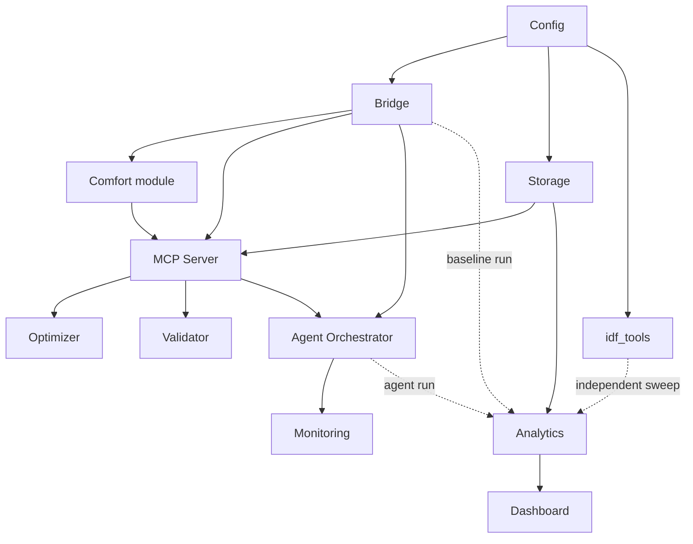

# PROJECT_UNDERSTANDING.md

**Project:** Eco-Loop Building Agents  
**Author:** Senior Software Engineer  
**Status:** Comprehensive Technical Synthesis & System Understanding  
**Authority:** Derived exclusively from Exhibit A (Project Bible, docs 00–17) and Exhibit B (Implementation Planning, docs 01–10). Architectural specifications are frozen and immutable.

---

## 1. Overall Project Objective

### Primary Objective
To design, build, and operate a closed-loop control system that couples **EnergyPlus** (via its native Python Runtime API) with an **LLM-driven Agent** operating exclusively through **Model Context Protocol (MCP)** tools. The system observes building telemetry, reasons about objective trade-offs (energy vs. comfort vs. demand/carbon), executes validated control actions against simulation setpoints, and closes the loop across simulated time. Success is measured by a statistically verified reduction in total facility energy consumption (kWh) relative to a schedule-driven baseline run while maintaining thermal comfort within an ASHRAE 55 band (PMV target $\pm 0.5$, hard safety band $\pm 1.5$) for a representative building model.

### Secondary Objectives
1. **Genuine Agentic Autonomy:** Demonstrate multi-turn observation, reasoning, tool invocation, and self-correction across at least one full simulated day without human intervention.
2. **Production-Shaped Seams with PoC-Scoped Guarantees:** Enforce strict process boundaries (MCP tool abstraction, independent deterministic validator, structured JSON logging, correlation IDs) so that interfaces do not require refactoring when extending to multi-building fleets or live BMS hardware, while keeping operational guarantees calibrated to a time-boxed Proof-of-Concept (PoC).
3. **Auditable Safety & Hallucination Prevention:** Enforce an architectural rule where no raw, unchecked LLM output ever reaches a physical actuator or simulation handle. All actions must pass a non-LLM, deterministic validation gate.
4. **Empirical Evidence & Comparability:** Provide identical, automated metrics computation (`compare_runs`) for baseline and agent-driven runs, surfaced via a quantitative dashboard and report.

---

## 2. System Architecture Summary

The system follows a **synchronous, callback-driven core with a decoupled, asynchronous periphery** (ADR-007):

```
+-----------------------------------------------------------------------------------+
| SIMULATION PROCESS                                                                |
|   +-------------------+        +----------------------------------------------+   |
|   | EnergyPlus Engine | <----> | EnergyPlus Bridge (pyenergyplus Runtime API) |   |
|   +-------------------+        +----------------------------------------------+   |
+---------------------------------------------------|-------------------------------+
                                                    | (in-callback, sync)
                                                    v
+-----------------------------------------------------------------------------------+
| AGENT PROCESS                                                                     |
|   +-------------------+        +----------------------------------------------+   |
|   | AgentOrchestrator | <----> | Memory (Rolling Window + Reflection Summary)  |   |
|   +---------|---------+        +----------------------------------------------+   |
+-------------|---------------------------------------------------------------------+
              | (stdio transport, JSON-RPC 2.0)
              v
+-----------------------------------------------------------------------------------+
| MCP SERVER PROCESS                                                                |
|   Tools: get_zone_state | get_weather_forecast | get_utility_signal | compute_pmv   |
|          propose_setpoints | validate_action | apply_setpoints                    |
|          get_history | log_decision | raise_incident                              |
+-------------------|---------------------------------------------------------------+
                    | (reads/writes)
                    v
+-----------------------------------------------------------------------------------+
| INFRASTRUCTURE & STORAGE                                                          |
|   +--------------------+     +-------------------+     +-----------------------+  |
|   | LLM Server         |     | Storage           |     | Dashboard / Analytics |  |
|   | (Ollama / vLLM)    |     | (DuckDB / SQLite) | --> | (Read-only consumer)  |  |
|   +--------------------+     +-------------------+     +-----------------------+  |
+-----------------------------------------------------------------------------------+
```

### Architectural Pillars
* **Integration Layer:** `pyenergyplus` Runtime API external callbacks (ADR-002). The Bridge registers callbacks at `callback_end_zone_timestep_after_zone_reporting` and `callback_after_predictor_after_hvac_managers`.
* **Tool Abstraction Boundary:** Model Context Protocol (MCP) using `stdio` transport (ADR-003). The LLM interacts with the simulation and environment *only* via 10 fixed, typed MCP tools.
* **Control Core:** Hybrid LLM-Supervisory control (ADR-005). The LLM determines high-level objective weighting ($w_{\text{energy}}$, $w_{\text{comfort}}$) based on qualitative context; setpoint arithmetic is solved by a deterministic optimizer tool (`propose_setpoints`), and candidate setpoints are gated by an independent deterministic validator (`validate_action`).
* **Persistence & Analytics:** Embedded DuckDB (with SQLite fallback) using an asynchronous, fire-and-forget buffer (ADR-006). Completed runs export to Parquet files for long-term auditability.

---

## 3. Runtime Execution Flow

1. **Process Startup & Configuration:**
   * `config/loader.py` reads and schema-validates YAML configuration (`configs/agent.yaml` or `baseline.yaml`).
   * Verifies LLM inference server reachability and spawns the MCP server subprocess over `stdio`.
   * Storage initializes embedded database tables (`runs`, `sensor_snapshots`, `decision_logs`, `incidents`, `run_summaries`).
   * Bridge creates a fresh `EnergyPlusAPI` state, registers callbacks, issues setup-time `request_variable` calls, and invokes `api.runtime.run_energyplus()`.

2. **Warmup & Environment Detection:**
   * EnergyPlus executes warmup days to converge thermal mass equations.
   * Callbacks fire during warmup; decision cycles are explicitly **gated off** by checking `api.exchange.warmup_flag()` and environment indicators. Telemetry is recorded with a `phase: warmup` tag.

3. **Per-Timestep Simulation Loop:**
   * **Every Zone Timestep:** EnergyPlus calls `callback_end_zone_timestep_after_zone_reporting`. Bridge reads sensors (`get_variable_value`), calculates PMV via deterministic `comfort/pmv.py`, and enqueues a `SensorSnapshot` to the async storage buffer.
   * **Cadence Check:** If the timestep aligns with the decision cadence (default: every 15 simulated minutes), Bridge initiates a decision cycle.

4. **Decision Cycle Execution:**
   * Bridge calls `on_decision_cycle()` synchronously, blocking the EnergyPlus callback.
   * Agent Orchestrator runs a ReAct loop: observes state, invokes read tools (`get_weather_forecast`, `get_utility_signal`, `get_history`), calls `propose_setpoints`, passes candidate to `validate_action`.
   * Upon successful validation, Agent invokes `apply_setpoints`. Server-side logic re-validates bounds and delegates handle actuation to Bridge.
   * On validation rejection or LLM/tool failure, in-cycle feedback allows 1 revision turn within the tool budget (default 6). If budget or cycle timeout (8s P95) expires, fallback controller (`hold_last_known_good`) engages and `raise_incident` is fired.
   * `DecisionLog` record is pushed asynchronously to Storage; EnergyPlus callback unblocks and simulation proceeds.

5. **Run Period End & Analytics:**
   * Simulation reaches natural completion; Bridge flushes remaining async telemetry buffers.
   * `analytics/aggregate.py` aggregates total kWh, PMV compliance percentages, and generates `RunSummary`.
   * Dashboard renders comparative metrics (`baseline` vs. `agent`).

---

## 4. Control Flow

```
[EnergyPlus Callback] 
       │
       ▼
[Bridge: Check Cadence] ── (Not Cadence Boundary) ──> [Return to EnergyPlus]
       │
       ├─ (Decision Cadence Boundary)
       ▼
[Agent Orchestrator: Assemble Context]
       │
       ▼
[LLM Inference Turn (ReAct)]
       │
       ├──> Tool Call: get_weather_forecast / get_utility_signal / get_history
       │         │
       │         ▼
       │    [MCP Server Exec & Return Result] ──> (Loop back to LLM)
       │
       ├──> Tool Call: propose_setpoints(objective_weights)
       │         │
       │         ▼
       │    [Deterministic Optimizer: Compute Candidate Setpoints] ──> (Return Candidate)
       │
       ├──> Tool Call: validate_action(candidate, cycle_id)
       │         │
       │         ▼
       │    [Deterministic Validator: Hard Min/Max & Comfort Bounds]
       │         │
       │         ├─── (PASS) ──> [LLM Calls apply_setpoints(action, cycle_id)]
       │         │                      │
       │         │                      ▼
       │         │                 [MCP Server: Server-Side Re-Check]
       │         │                      │
       │         │                      ▼
       │         │                 [Bridge: set_actuator_value()]
       │         │                      │
       │         │                      ▼
       │         │                 [Async Log Decision & Return Success]
       │         │
       │         └─── (FAIL) ──> [Feed Failure Reason to LLM]
       │                                │
       │                                ├──> [Retry within budget (max 1 turn)]
       │                                └──> [Exhausted/Timeout: Fallback Path]
       │                                           │
       │                                           ▼
       │                                      [Bridge: Hold Last Known-Good]
       │                                      [MCP: raise_incident()]
       │
       ▼
[Unblock EnergyPlus Callback]
```

---

## 5. Data Flow

### Primary Message & Record Types (`shared/types.py`)

| Type | Source | Destination | Persistence |
|---|---|---|---|
| `SensorSnapshot` | Bridge (every timestep) | Storage (async buffer), Agent | Yes (Table: `sensor_snapshots`) |
| `ForecastWindow` | `get_weather_forecast` | Agent Orchestrator | No (ephemeral prompt context) |
| `UtilitySignal` | `get_utility_signal` | Agent Orchestrator | Optional (if carbon/price enabled) |
| `ObservationContext` | Agent Orchestrator | LLM Server (Prompt) | No |
| `CandidateAction` | `propose_setpoints` | `validate_action`, Agent | Yes (embedded in `DecisionLog`) |
| `ValidationResult` | `validate_action` | Agent Orchestrator | Yes (embedded in `DecisionLog`) |
| `ActuatorCommit` | `apply_setpoints` -> Bridge | EnergyPlus API | Yes (embedded in `DecisionLog`) |
| `Incident` | `raise_incident` / Guard | Storage, Monitoring | Yes (Table: `incidents`) |
| `DecisionLog` | Agent Orchestrator | Storage (async buffer) | Yes (Table: `decision_logs`) |
| `RunSummary` | Analytics | Dashboard | Yes (Table: `run_summaries`) |

### Asynchronous Telemetry Buffer & Backpressure
To guarantee that database slowness never stalls the EnergyPlus callback:
* All writes to Storage flow into a bounded in-memory queue handled by a background writer thread (`storage/writer.py`).
* Under backpressure (queue capacity reached), high-frequency telemetry (`SensorSnapshot`) is dropped first.
* Low-frequency, high-value audit records (`DecisionLog`, `Incident`) are **never dropped**.

### Idempotency & Retries
* **Read-Only Tools:** `get_zone_state`, `get_weather_forecast`, `get_utility_signal`, `compute_pmv`, `get_history` are pure or side-effect-free; retried up to 2 times with exponential backoff on transport failure.
* **Deterministic Compute:** `validate_action` and `propose_setpoints` are pure functions. Retrying with identical arguments returns identical results.
* **Side-Effect Writes:** `apply_setpoints`, `log_decision`, and `raise_incident` require a unique `cycle_id`. Re-invoking `apply_setpoints` with an identical `cycle_id` and action returns `committed: true` without re-writing actuators. Re-invoking with a conflicting action returns an error (`cycle_id_action_mismatch`). `apply_setpoints` is **never blindly retried** on transport timeout to avoid double-application risks (RR-2).

---

## 6. Component Dependency Graph



### Topological Build Order
`Config` $\rightarrow$ {`Bridge`, `Storage`, `idf_tools`} $\rightarrow$ {`Comfort`, `MCP Server`} $\rightarrow$ {`Optimizer`, `Validator`, `Agent Orchestrator`} $\rightarrow$ {`Monitoring`, `Analytics`} $\rightarrow$ `Dashboard`.

---

## 7. Repository Structure

```
eco-loop-building-agents/
├── src/
│   ├── shared/         # Shared record types (types.py) & JSON logging wrapper (logging.py)
│   ├── config/         # Config schema (schema.py) & loader (loader.py)
│   ├── bridge/         # EnergyPlus Runtime API lifecycle, callbacks, handle caching
│   ├── comfort/        # Deterministic PMV/PPD Fanger model (pmv.py)
│   ├── optimizer/      # Bounded-horizon deterministic setpoint solver (solver.py)
│   ├── validator/      # Pure deterministic min/max & comfort safety gate (bounds.py)
│   ├── agent/          # ReAct orchestrator, 2-tier memory, LLM client wrapper
│   ├── mcp_server/     # MCP stdio server & 10 discrete tool implementations in tools/
│   ├── storage/        # Embedded DuckDB/SQLite schema, async writer, queries
│   ├── analytics/      # Metric aggregation & compare_runs logic
│   ├── dashboard/      # Read-only web visualization (app.py)
│   ├── idf_tools/      # Offline eppy-based ECM variant generator (ecm_sweep.py)
│   └── monitoring/     # Ephemeral health status & degraded mode tracker (health.py)
├── tests/
│   ├── unit/           # Per-module unit tests (dependencies mocked)
│   ├── integration/    # Subsystem integration (Bridge+E+, MCP contract, Agent+MCP)
│   ├── simulation/     # Short design-day & baseline execution tests
│   ├── fault_injection/# 10 explicit failure condition injection suites (FC-1 to FC-10)
│   ├── stress/         # Cycle latency & memory growth stress tests
│   ├── recovery/       # Process kill-and-restart non-duplication tests
│   └── regression/     # Golden-run deterministic output verification
├── configs/            # YAML run configurations (baseline.yaml, agent.yaml)
├── data/               # IDF models (baseline.idf, ecm_variants/) & EPW weather files
├── docs/               # Frozen Project Bible (project_bible/) & Implementation Specs (implementation/)
└── scripts/            # CLI entrypoints (run_baseline.py, run_agent.py, run_ecm_sweep.py)
```

---

## 8. Implementation Stages

* **Stage 1: Foundation:** Repository structure, `pyproject.toml`, pinned dependencies (`pyenergyplus` v26.2, `eppy`, MCP SDK, DuckDB), `config/` loader, CI matrix (Linux/macOS).
* **Stage 2: EnergyPlus Bridge:** `bridge/` lifecycle, callback registration, handle caching post-`api_data_fully_ready`, warmup gating, `comfort/` integration. *(Parallel Track: `idf_tools/` for offline ECM `.idf` generation)*.
* **Stage 3: Storage:** `storage/` DuckDB/SQLite schema, async queue buffer, priority backpressure handling. *(Parallel Track: Execute full-annual baseline run)*.
* **Stage 4: MCP Server:** `mcp_server/` stdio server, 10 tool implementations, `optimizer/` solver, `validator/` bounds module with property fuzzing.
* **Stage 5: LLM Agent:** `agent/` ReAct orchestrator loop, 2-tier memory (rolling window + daily reflection), constrained-decoding LLM client, `monitoring/` degraded mode tracker.
* **Stage 6: Analytics & Dashboard:** `analytics/` aggregation logic, `compare_runs` endpoint, read-only `dashboard/` web interface.
* **Stage 7: Full-System Testing:** Execution of fault-injection (FC-1..10), stress, recovery, and regression test suites. Demonstration of criteria A1–A5.
* **Stage 8: Deployment & Packaging:** Multi-container Docker setup, final representative-day and annual baseline runs, demo video recording, presentation assembly.

---

## 9. Architectural Guardrails (23 Absolute Rules)

1. **Bridge is the only EnergyPlus interface.** No module outside `src/bridge/` imports `pyenergyplus` or calls Runtime API functions.
2. **No direct actuator writes outside Bridge.** `apply_setpoints` tool delegates all writes to `bridge/`.
3. **`.idf` editing and runtime control are decoupled.** Offline `eppy` editing (`idf_tools/`) and runtime Actuator API writes (`bridge/`) never interact.
4. **No component bypasses `validate_action`.** All proposed actions must be validated before reaching an actuator.
5. **`apply_setpoints` independently re-validates server-side**, regardless of whether `validate_action` was called previously in the cycle.
6. **The LLM never performs numeric optimization.** `propose_setpoints` handles setpoint arithmetic; the LLM selects objective weights.
7. **The LLM never writes actuators directly.** All writes pass through `apply_setpoints`.
8. **PMV/PPD is computed deterministically** via `compute_pmv` (Fanger/ISO 7730), never estimated by the LLM.
9. **Every actuator has hard-coded, config-defined min/max bounds** independent of the LLM.
10. **Fail-safe fallback on any failure:** The system holds the last known-good or scheduled setpoint on validator rejection, timeout, or error.
11. **No shell, file-write, or code-execution tools are exposed to the agent.**
12. **The MCP tool catalog is fixed at exactly 10 tools.** No dynamic tool registration.
13. **The agent cannot mutate allow-lists, bounds, or tool schemas.**
14. **Raw simulation logs never enter LLM context by default.** Context receives only bounded, aggregated summaries via `get_history`.
15. **The decision loop is synchronous, in-callback, and bounded by a cycle-level timeout (8s P95).**
16. **Storage writes are asynchronous and non-blocking** relative to the EnergyPlus callback.
17. **Every write tool (`apply_setpoints`, `log_decision`, `raise_incident`) is idempotent by `cycle_id`.**
18. **`apply_setpoints` is never blindly retried** on transport failure or timeout.
19. **Every tool call, argument set, and result is logged with its `cycle_id`.**
20. **Runtime configuration is immutable after process load.**
21. **Dashboard is strictly read-only.** No write paths exist to Storage, Bridge, or Agent.
22. **Simulation-only safety boundary.** System operates against EnergyPlus only; no connection to real BMS/hardware.
23. **ADR decisions are immutable without formal Project Bible amendments.**

---

## 10. Major Technical Risks (`16_Risk_Register.md`)

| Risk ID | Description | Likelihood | Impact | Mitigation |
|---|---|---|---|---|
| **R-01** | Validator logic gap allows unsafe action | Low | High | Exhaustive property-based fuzzing of `validator/`; redundant server-side re-check in `apply_setpoints`. |
| **R-02** | EnergyPlus fatal error mid-run | Medium | Medium | Graceful termination, telemetry flush, mark `RunSummary.status = incomplete`. |
| **R-03** | LLM inference server crash/OOM | Medium | Medium | Fallback controller (RR-3), background reconnection attempts, degraded mode after 3 consecutive failures. |
| **R-04** | Annual every-timestep AI run wall-clock timeout | High | Medium | Representative-day sampling strategy (PR-3 / ADR-009) adopted explicitly. |
| **R-05** | Agent prompt context length blowup | Medium | Medium | Two-tier memory (rolling window + daily reflection) and pull-not-push `get_history` queries. |
| **R-06** | Energy optimization sacrifices comfort | Medium | High | Hard PMV band constraint ($\pm 1.5$); acceptance criterion S5 enforces agent comfort compliance $\ge$ baseline. |
| **R-07** | LLM sampling non-determinism in demo | Medium | Low | Deterministic sampling configuration (temperature=0, fixed seed) for regression/demo. |
| **R-08** | EnergyPlus API handle resolution drift | Low | Medium | Explicit version pinning (v26.2), lazy startup handle validation against loaded `.idf`. |
| **R-09** | Hardware GPU unavailability for demo | Medium | High | Quantized CPU-runnable fallback model; pre-recorded run backup. |
| **R-10** | External data feed prompt injection | Low (PoC) | Medium | File-derived stubs in PoC; validator gate operates independently of external content. |
| **R-11** | Configured actuator missing from `.idf` | Low | Medium | Startup schema and handle-resolution validation fails fast before `run_energyplus()`. |
| **R-12** | Storage backpressure drops critical logs | Low | Low | Prioritized drop policy: telemetry dropped first; `DecisionLog` and `Incident` never dropped. |

---

## 11. Testing Strategy

### Test Pyramid & Methodologies (`13_Testing.md`)
1. **Unit Tests:** 
   * `comfort/pmv.py`: Golden-value tests against ISO 7730 reference tables.
   * `validator/bounds.py`: Exhaustive property-based fuzzing using randomized out-of-bound inputs.
   * `optimizer/solver.py`: Boundary constraint tests & infeasibility detection.
   * `config/loader.py`: Rejection of malformed configs and missing endpoints.
2. **Integration Tests:**
   * Agent Orchestrator + MCP Server (scripted LLM stub, mocked EnergyPlus).
   * Bridge + EnergyPlus (scripted decision cycle, real EnergyPlus execution).
   * MCP Tool Contract Suite (input/output schema validation for all 10 tools).
3. **Simulation-Level Tests:** Short design-day runs (1–2 days) in CI; full representative-day runs pre-release.
4. **Fault Injection Suite:** Execution of all 10 failure conditions (FC-1 to FC-10) asserting observed graceful degradation.
5. **Stress & Recovery Suites:** High-cadence backpressure stress tests, context window growth verification over multi-day runs, process kill-and-restart recovery without duplicate rows.
6. **Regression Suite:** Golden-run comparison using deterministic sampling settings.

---

## 12. Security Model

* **Threat Model Framing:** The primary threat is **LLM unreliability / semi-adversarial behavior**, not external network penetration. The LLM is treated as an untrusted input provider.
* **Prompt Injection Defense:** Structural isolation. Tool outputs cannot expand the tool set; all actuator commands are checked numerically against hard bounds by `validate_action` and `apply_setpoints`, bypassing LLM intent entirely.
* **Tool Abuse Mitigations:** Fixed 10-tool catalog (SR-3); strict budget cap (max 6 calls per cycle); config-loaded positive allow-lists; correlation-ID logged traces.
* **Sandboxing:** No shell, arbitrary file-write, or code-execution tools. Process-level containment via Docker containers with minimal filesystem and network privileges.

---

## 13. Performance Strategy

* **Critical Path Bottleneck:** LLM token generation latency dominates end-to-end cycle time ($\le 8\text{ s}$ P95 target).
* **Prompt Latency Optimizations:**
  1. Static prefix caching (system prompt and tool schemas kept invariant to leverage KV-cache reuse in Ollama/vLLM).
  2. Bounded tool-call budget (max 6 turns/cycle).
  3. Small, sharply defined 10-tool catalog.
  4. Two-tier model allocation (lightweight model for per-cycle ReAct, heavier model for daily reflection).
  5. Cycle-level timeout wrapping the entire ReAct loop.
* **Handling Lengthy Simulation Logs:** "Pull, not push" architecture. Raw telemetry is never stuffed into prompts. The LLM receives the current snapshot + compact memory window. Historical lookups use the `get_history` tool with pre-aggregated, bounded query shapes.

---

## 14. Architecture Decision Records (ADRs) Summary

* **ADR-001:** Python selected for first-party `pyenergyplus`/`eppy` integration and rich MCP/LLM ecosystem.
* **ADR-002:** EnergyPlus Python Runtime API (`pyenergyplus.api.EnergyPlusAPI`) external callback model selected over Erl/EMS, Python Plugins, BCVTB, or FMUs.
* **ADR-003:** MCP stdio transport selected over REST/OpenAPI or in-process function calling for hard security boundaries and standardized error models.
* **ADR-004:** Self-hosted open-weight LLMs with requirements-based selection (constrained decoding, KV-caching, latency budget) instead of hardcoding a specific model name.
* **ADR-005:** Hybrid control architecture (LLM supervisor + deterministic optimizer + deterministic validator) selected over pure MPC, pure RL, or pure end-to-end LLM control.
* **ADR-006:** Embedded DuckDB (with SQLite fallback) and Parquet archival selected for PoC; TimescaleDB named as production migration target.
* **ADR-007:** Synchronous in-callback decision loop selected over an async queue for control core; asynchronous fire-and-forget buffer used for telemetry/storage.
* **ADR-008:** Decoder-level constrained/structured decoding enabled for syntax reliability, paired with mandatory downstream semantic validation.
* **ADR-009:** Representative-day sampling strategy adopted for AI-driven runs; full-annual run reserved for baseline comparison.
* **ADR-010:** Analytical Fanger/ISO 7730 PMV formula selected over a learned comfort model.
* **ADR-011:** Containerized process isolation with a fixed 10-tool MCP catalog; absolute prohibition of shell/file-write tools.
* **ADR-012:** Plain Markdown with Mermaid diagrams selected for Project Bible documentation.

---

## 15. Critical Invariants

The implementation must never violate any of the following 15 frozen architectural invariants:
1. **Single Entry Point for Simulation Control:** `src/bridge/` is the only module permitted to import `pyenergyplus` or invoke Runtime API functions.
2. **No Out-of-Band Actuator Writes:** No module outside `src/bridge/` and `mcp_server/tools/apply_setpoints.py` may write to an EnergyPlus actuator.
3. **No Mid-Run IDF Modification:** `.idf` editing (`idf_tools/`) is strictly offline/preprocessing. Mid-run control occurs exclusively through the Runtime Actuator API.
4. **Mandatory Action Validation:** No proposed setpoint action may reach an actuator without passing `validate_action`.
5. **Redundant Server-Side Re-validation:** `apply_setpoints` must independently re-validate setpoints against config bounds before calling Bridge actuation.
6. **No LLM Setpoint Arithmetic:** The LLM must never compute numeric setpoint optimization; arithmetic is strictly performed by `propose_setpoints`.
7. **No Direct LLM Actuator Access:** The LLM has no tool to write directly to actuators; all setpoint modifications pass through `apply_setpoints`.
8. **Analytical Comfort Computation:** PMV/PPD must be computed by `comfort/pmv.py` using Fanger's analytical model; never estimated by the LLM.
9. **Immutable Actuator Bounds:** Every actuator must have hard-coded min/max bounds loaded from configuration, unmodifiable by the LLM or runtime logic.
10. **Fail-Safe Fallback:** On validator rejection, tool error, or cycle timeout, the system must hold the last known-good or scheduled setpoint.
11. **Strict Tool Capability Boundaries:** No shell execution, arbitrary file-write, or code-evaluation tools may ever be exposed to the agent.
12. **Fixed Tool Catalog:** The MCP server must register exactly 10 tools. Dynamic tool creation is prohibited.
13. **Immutable Operational Parameters:** The agent cannot alter actuator allow-lists, comfort bands, decision cadence, or tool schemas.
14. **No Raw Telemetry Injection:** Raw simulation logs and historical telemetry must never be injected directly into prompt context.
15. **Synchronous Control / Asynchronous Storage:** The control callback loop is synchronous and blocking; telemetry and log storage writes are strictly asynchronous and non-blocking.

---

## 16. Underspecified Items & Setup-Time Requirements

The following items are identified in Exhibit A & B as requiring concrete selection or binding during environment setup/implementation, without altering architectural boundaries:

1. **Concrete Building Model & Weather File Selection:**
   * *Reference:* `00_Project_Overview.md` §4, `07_EnergyPlus_Design.md` §7.
   * *Detail:* Selecting the exact DOE reference model (e.g., Small Office vs. Medium Office `.idf`) and EPW weather file location.
2. **Model-Specific Actuator Triple Mapping:**
   * *Reference:* `07_EnergyPlus_Design.md` §3, `01_Requirements.md` SR-1/SR-2, `configs/agent.yaml`.
   * *Detail:* Extracting the exact `(component_type, control_type, key)` string triples and numerical physical bounds from the selected `.idf` to populate `configs/agent.yaml`.
3. **LLM Inference Model & Server Stack Binding:**
   * *Reference:* `08_LLM_and_Agent_System.md` §5, `15_Performance.md` §2, ADR-004.
   * *Detail:* Selecting the specific open-weight model family (e.g., Llama-3-8B-Instruct, Qwen-2.5-7B-Instruct) and local serving backend (Ollama vs. vLLM vs. llama.cpp-server) matching available host GPU hardware.
4. **`propose_setpoints` Heuristic Evaluation Function:**
   * *Reference:* `06_Control_System.md` §3, `09_MCP_Architecture.md` §2.5, `optimizer/solver.py`.
   * *Detail:* Implementing the precise short-horizon discrete search or grid evaluation code for the setpoint candidate space within `optimizer/solver.py`.
5. **Daily Reflection Prompt Template:**
   * *Reference:* `08_LLM_and_Agent_System.md` §3, `agent/memory.py`.
   * *Detail:* Writing the explicit natural language prompt template for the end-of-simulated-day reflection summary step.
6. **Reference Hardware Profile Calibration:**
   * *Reference:* `01_Requirements.md` PR-1, `15_Performance.md` §1.
   * *Detail:* Benchmarking token generation speed on the deployment host machine to calibrate `cycle_timeout_seconds` (default: 8s).
