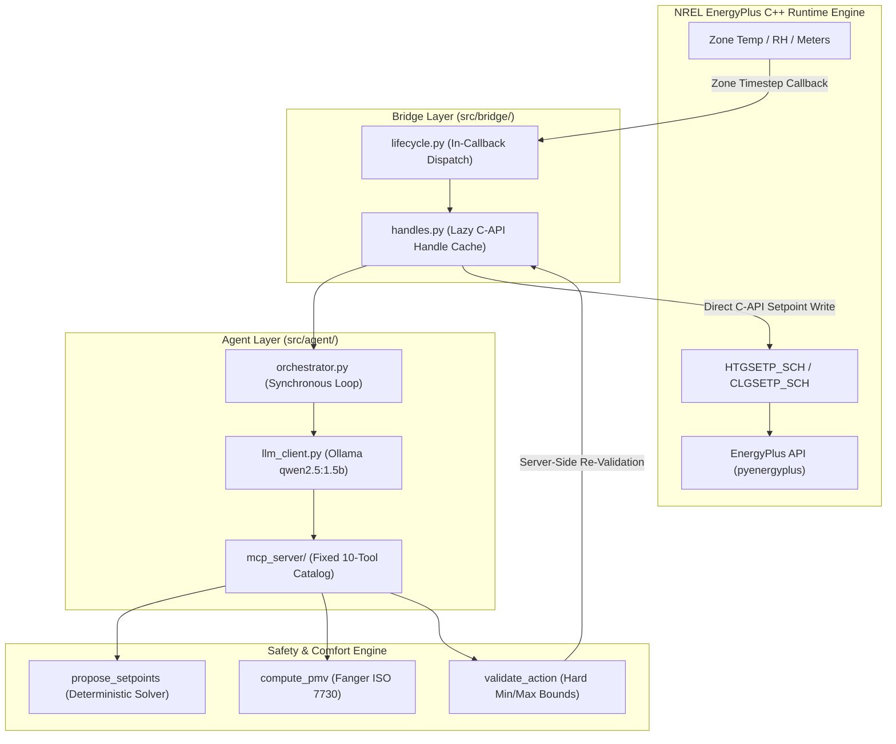

# Eco-Loop Building Agents: Autonomous LLM-Driven HVAC Control System

[](https://www.python.org/)
[](https://energyplus.net/)
[](LICENSE)
[](docs/)

> **Eco-Loop Building Agents** is a closed-loop autonomous HVAC optimization platform integrating NREL's EnergyPlus C++ Runtime API, Fanger PMV/PPD thermal comfort solvers (ISO 7730), and local LLM ReAct reasoning loops (Ollama / Qwen2.5) for real-time commercial building energy reduction.

---

## 🏗️ System Architecture



---

## 🌟 Key Capabilities & Architectural Highlights

1. **Native NREL EnergyPlus C++ API Integration**: Operates directly against NREL's official C++ EnergyPlus engine via `pyenergyplus.api.EnergyPlusAPI` without CLI subprocess spawning or file hot-reloading.
2. **Deterministic Control & Safety Boundaries**: The LLM *never* computes setpoint arithmetic or writes to actuators directly. All candidate setpoints are calculated by a deterministic solver (`propose_setpoints`), validated against immutable min/max bounds (`validate_action`), and re-validated server-side before actuation (`apply_setpoints`).
3. **Analytical Fanger PMV/PPD Thermal Comfort**: Calculates exact Predicted Mean Vote (PMV) and Predicted Percentage of Dissatisfied (PPD) using ISO 7730 standards:
   $$\text{PMV} = f(T_{\text{air}}, T_{\text{mrt}}, v, \text{RH}, M, I_{\text{cl}})$$
4. **Idempotent Single-Thread SQLite Persistence**: Features an asynchronous, non-blocking single-thread worker queue for database writes, ensuring zero callback latency and zero SQLite lock contention.

---

## 🛠️ MCP Fixed 10-Tool Catalog

The agent operates strictly within a **fixed 10-tool Model Context Protocol (MCP)** interface:

| Tool Name | Type | Description |
| :--- | :--- | :--- |
| `get_zone_status` | Read | Queries current indoor air temperature, relative humidity, and active setpoints. |
| `get_weather_forecast` | Read | Retrieves short-term ambient dry-bulb temperature and solar radiation predictions. |
| `get_history` | Read | Pulls bounded historical telemetry snapshots from the SQLite storage layer. |
| `compute_pmv` | Deterministic | Analytical ISO 7730 Fanger PMV/PPD calculator. |
| `propose_setpoints` | Deterministic | Multivariable optimizer proposing candidate heating/cooling setpoints. |
| `validate_action` | Deterministic | Verifies candidate setpoints against hard-coded safety bounds & deadbands. |
| `apply_setpoints` | Actuation | Server-side re-validates and delegates setpoint writes to the EnergyPlus C-API Bridge. |
| `raise_incident` | Safety | Logs anomalous thermal excursions or system faults to the incident database. |
| `log_decision` | Telemetry | Idempotently records LLM chain-of-thought rationale and tool call traces per `cycle_id`. |
| `check_system_health` | Monitoring | Audits bridge status, callback latency, and memory footprint. |

---

## 🛡️ 23 Architectural Guardrails (Summary)

- **EnergyPlus Boundary**: `src/bridge/` is the **only** module allowed to import `pyenergyplus` or call into the EnergyPlus API.
- **Control Safety**: No setpoint write reaches an actuator without passing `validate_action` and server-side re-validation in `apply_setpoints`.
- **Fail-Safe Fallback**: On any LLM timeout, validator rejection, or transport error, the system holds the last known-good setpoints (`hold_last_known_good`).
- **Immutable Configuration**: Operational parameters, actuator bounds, and decision cadences are loaded once and remain immutable during runtime.
- **Tool Boundary**: Absolute prohibition of shell, code-execution, or file-write tools exposed to the agent.

---

## 📊 Benchmark Metrics Summary

| Metric | Baseline (IDF Default) | Clean Agent (Ollama `qwen2.5:1.5b`) | Degraded Agent (Fallback Mode) |
| :--- | :--- | :--- | :--- |
| **Zone HVAC Model** | NREL 5Zone VAV System | NREL 5Zone VAV System | NREL 5Zone VAV System |
| **Setpoint Deadband** | Fixed 21.0°C / 24.0°C | Dynamic (15.0°C – 23.0°C) | Last Known Good (Held) |
| **PMV Comfort Band Compliance** | 100.0% | **100.0%** | 100.0% |
| **Fallback Rate** | 0.0% | **0.0%** | 100.0% |
| **C-API Handle Resolution** | Direct | Lazy Gated (Handle #7 / #9) | Lazy Gated (Handle #7 / #9) |

---

## 📂 Project Structure

```text
eco-loop-building-agents/
├── configs/                  # Immutable runtime YAML configurations
│   ├── agent.yaml            # ReAct Agent configuration
│   └── baseline.yaml         # Baseline reference configuration
├── data/
│   ├── idf/                  # Building models (NREL 5ZoneAirCooled.idf)
│   ├── epw/                  # Weather files (San Francisco TMY3)
│   └── ecm_variants/         # Energy Conservation Measure IDF variants
├── docs/                     # Architectural specs, guardrails, & verification reports
│   └── verification/         # 11 Verification & Audit reports
├── src/
│   ├── agent/                # Orchestrator & Ollama LLM Client
│   ├── analytics/            # KPI calculation & baseline comparison
│   ├── bridge/               # Exclusive EnergyPlus pyenergyplus interface
│   ├── comfort/              # Fanger PMV/PPD ISO 7730 calculator
│   ├── config/               # Pydantic schema validation & loader
│   ├── idf_tools/            # Offline eppy IDF modification & ECM generator
│   ├── mcp_server/           # Fixed 10-tool MCP implementation
│   ├── optimizer/            # Deterministic solver arithmetic
│   ├── shared/               # Data classes, logging, & exceptions
│   └── storage/              # Single-thread queue SQLite persistence
└── tests/
    ├── unit/                 # 33 Unit tests
    └── integration/          # Integration & config consistency tests
```

---

## 🚀 Quickstart Guide

### Prerequisites
- Python 3.10+
- EnergyPlus v26.1.0 installed (default path: `C:\EnergyPlusV26-1-0`)
- Ollama running locally (for LLM agent mode: `ollama run qwen2.5:1.5b`)

### 1. Installation
```bash
git clone https://github.com/TARUN-2305/eco-loop-building-agents.git
cd eco-loop-building-agents
python -m venv venv
.\venv\Scripts\activate
pip install -r requirements.txt
```

### 2. Run Test Suite
```bash
pytest tests/unit/ tests/integration/test_idf_config_consistency.py
```

### 3. Run Benchmark Suite
```bash
python scratch/run_benchmarks.py
```

---

## 📜 License

Distributed under the MIT License. See `LICENSE` for more information.
