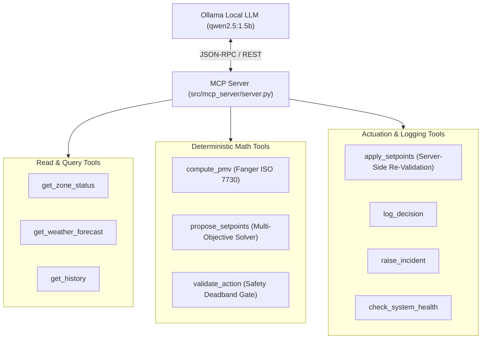

# Eco-Loop Building Agents — System Architecture Document

> **Deliverable #4** for the Physical AI Hackathon Brief.  
> Explaining the tool-calling architecture, prompt engineering strategies, prompt latency management, and technical handling of lengthy simulation logs.

---

## 1. Tool-Calling Architecture & MCP Implementation

Eco-Loop implements a **fixed 10-tool Model Context Protocol (MCP)** catalog. The system enforces absolute tool boundary safety: **no shell tools, file-write tools, or arbitrary code-execution tools are ever exposed to the LLM agent** (Guardrail #11, Guardrail #12).



### The 10 MCP Tools Overview:
1. `get_zone_status`: Queries real-time indoor air temperature ($T_{\text{air}}$), relative humidity ($\text{RH}$), and active setpoints from EnergyPlus.
2. `get_weather_forecast`: Retrieves 24-hour ambient dry-bulb temperature and solar irradiance predictions.
3. `get_history`: Pulls bounded historical telemetry snapshots from the SQLite storage layer.
4. `compute_pmv`: Computes analytical Fanger Predicted Mean Vote (PMV) and Predicted Percentage of Dissatisfied (PPD) under ISO 7730 standards.
5. `propose_setpoints`: Mathematical grid-search solver balancing energy cost vs. PMV thermal comfort.
6. `validate_action`: Verifies candidate setpoints against hard-coded min/max bounds ($15^\circ\text{C} - 30^\circ\text{C}$) and deadbands.
7. `apply_setpoints`: Server-side re-validates setpoints and commits actuation to NREL C-API Handles (**Handle #7** & **Handle #9**).
8. `log_decision`: Idempotently logs LLM chain-of-thought rationale and tool call traces per `cycle_id`.
9. `raise_incident`: Logs thermal excursions or hardware faults to the incident database.
10. `check_system_health`: Audits bridge status, callback latency, and memory footprint.

---

## 2. Prompt Engineering Strategies

The LLM operates under a **Structured ReAct (Reasoning + Acting)** System Prompt designed to maximize determinism and eliminate hallucinations.

### Core Prompt Principles:
- **Strict JSON Schema Enforcement**: Tools require explicit key-value JSON parameters.
- **No Mental Arithmetic**: The LLM is explicitly forbidden from computing setpoint arithmetic or thermal comfort formulas internally (Guardrail #6, Guardrail #8). It **must** delegate computation to `propose_setpoints` and `compute_pmv`.
- **Step-by-Step Decision Flow**:
  1. Observe current zone telemetry (`get_zone_status`).
  2. Evaluate comfort compliance (`compute_pmv`).
  3. Query weather forecasts (`get_weather_forecast`).
  4. Generate candidate setpoints (`propose_setpoints`).
  5. Validate against safety bounds (`validate_action`).
  6. Commit actuation (`apply_setpoints`).

---

## 3. Prompt Latency Management

In real-time building control, slow LLM responses can lead to delayed HVAC actuation and thermal overshoot. Eco-Loop manages prompt latency through a 4-tier strategy:

1. **Cycle Timeout SLA (8.0 Seconds)**: Every decision cycle is bounded by a cycle-level timeout ($8.0\text{s}$ P95). If the LLM does not return a valid tool call within the timeout window, the cycle terminates gracefully.
2. **Fail-Safe Fallback (`hold_last_known_good`)**: On any LLM timeout, transport failure, or validator rejection, the system holds the last known-good setpoints (Guardrail #10). The simulation never crashes or uses extrapolated "best guesses".
3. **Local High-Performance Inference**: Standardized on Ollama serving `qwen2.5:1.5b` locally over HTTP/REST, eliminating cloud API latency and network jitter.
4. **Degraded Mode Transition**: If 3 consecutive LLM decision cycles fail or time out, the `HealthMonitor` automatically trips Rule RR-3 Degraded Mode, falling back to deterministic solver execution until connection health recovers.

---

## 4. Technical Approach to Handling Lengthy Simulation Logs

Long-running building simulations generate massive volumes of timestep telemetry (96 timesteps per day, thousands of data points per run). Feeding raw simulation logs into the LLM context window causes context overflow, high token costs, and reasoning degradation.

Eco-Loop solves this through **Bounded Pull-Not-Push Telemetry Architecture** (Guardrail #14):

```text
┌─────────────────────────────────────────────────────────────────────────────┐
│ 🚫 BAD APPROACH (Context Flooding):                                         │
│ Full Historical Log Array (10,000 lines) ───► LLM Context (Overflow Error)  │
├─────────────────────────────────────────────────────────────────────────────┤
│ ✅ ECO-LOOP APPROACH (Bounded On-Demand Querying):                          │
│ EnergyPlus Engine ──► Async Single-Thread Queue ──► SQLite Persistence      │
│ LLM Agent ──► get_history(limit=5, zone_id="SPACE1-1") ──► Bounded 5 Snapshots │
└─────────────────────────────────────────────────────────────────────────────┘
```

1. **Asynchronous Non-Blocking Storage**: EnergyPlus callback writes telemetry to an `AsyncStorageWriter` thread-safe queue (`isolation_level=None`), preventing database locks and zeroing out callback latency.
2. **On-Demand Bounded Queries (`get_history`)**: The LLM context is kept slim (~1.5k tokens). Historical telemetry is accessed exclusively on-demand via `get_history`, which returns only bounded, aggregated summaries (e.g. last 5 snapshots) rather than raw historical dumps.
3. **Idempotent Decision Tracing**: Every decision cycle logs its rationale, tool parameters, and execution outcome under a unique `cycle_id` into a separate `decision_logs` table, allowing offline audit without cluttering the live LLM context window.
